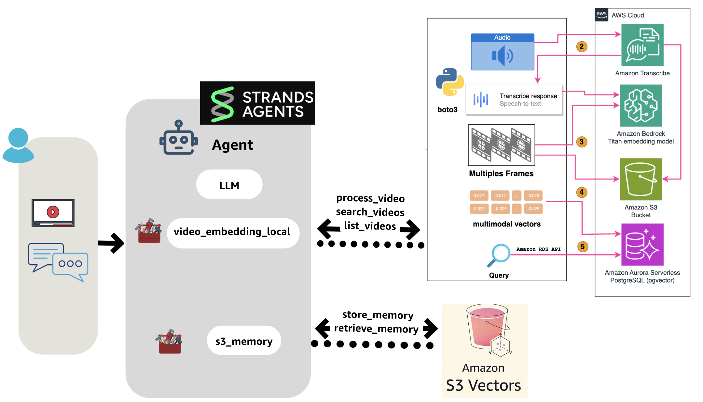

## 🚀 Multimodal Search Learning Experience


> [Getting started with Amazon Bedrock, RAG, and Vector database in Python](https://github.com/build-on-aws/llm-rag-vectordb-python)

<div align="center">
  
  [](https://github.com/build-on-aws/langchain-embeddings/stargazers)
  [](https://github.com/build-on-aws/langchain-embeddings/network)
  [](LICENSE)
  [](https://python.org)
  [](https://aws.amazon.com/bedrock/)
  [](https://langchain.com)
  
  
  <br>
  <p><em>Search across text, images, and video content with natural language queries</em>
  </p>
   <p>⭐ Star this repository</p>
  
</div>

<div align="center">

**🎯 Learning Path: Explore → Build → Scale**

</div>

| 🛠️ Component | 📝 What You'll Learn | ⏱️ Time | 📊 Level |
|--------------|---------------------|----------|----------|
| **[📓 Jupyter Notebooks](notebooks/)** | Multimodal AI fundamentals with interactive tutorials | 30-120 min |  |
| **[🗄️ Aurora PostgreSQL Vector Database](create-aurora-pgvector/)** | Vector database setup with pgvector extension | 15 min |  |
| **[⚡ Serverless Lambda Vector Database System](serveless-embeddings/)** | Multi-modal document processing with Lambda | 10 min |  |
| **[🥠Ask Your Video: Audio/Video Processing Pipeline](container-video-embeddings/)** | Video analysis with ECS and vector search | 25 min |  |

---

## 📓 Learning Notebooks


| 📓 Notebook | 🎯 Focus & Key Learning | ⏱️ Time | 📊 Level | 🖼️ Diagram |
|-------------|------------------------|----------|----------|------------|
| **01 - [Semantic Search with LangChain, Amazon Titan Embeddings, and FAISS](notebooks/01_build_pdf_vector_db.ipynb)** | Text embeddings and PDF processing - Document chunking, embeddings generation, FAISS vector store operations | 30 min |  |  |
| **02 - [Building a Multimodal Image Search App with Titan Embeddings](notebooks/02_build_images_vector_db.ipynb)** | Visual search capabilities - Image embeddings, multimodal search, natural language image queries | 45 min |  |  |
| **03 - [Supercharging Vector Similarity Search with Amazon Aurora and pgvector](notebooks/03_build_pgvector_db.ipynb)** | Production database setup - PostgreSQL vector operations, pgvector extension, scalable similarity search | 60 min |  |  |
| **04 - [Video Understanding](notebooks/04_video_understanding.ipynb)** | Video content analysis - Nova models for video processing, content extraction, video understanding workflows | 45 min |  |  |
| **05 - [Video and Audio Content Analysis with Amazon Bedrock](notebooks/05_create_audio_video_embeddings.ipynb)** | Audio processing workflows - Transcription, audio embeddings, multimedia content analysis | 40 min |  |  |
| **06 - [Building Agentic Video RAG with Strands Agents - Local](notebooks/06_video_embeddings_with_strands_enhanced.ipynb)** | AI agents for video analysis - Local agent implementation, memory-enhanced agents, persistent context storage | 90 min |  |  |
| **07 - [Building Agentic Video RAG with Strands Agents - Cloud](notebooks/07_video_embeddings_container_with_strands_agents.ipynb)** | Production agent deployment - Cloud-based agent architecture, ECS deployment, scalable agent workflows | 120 min |  |  |

---

## ☁️ Demo Applications

| 🏗️ Application | 📝 Description | ⏱️ Deploy Time | 📊 Complexity | 🖼️ Diagram |
|----------------|----------------|----------------|---------------|------------|
| **[🗄️ Aurora PostgreSQL Vector Database](create-aurora-pgvector/)** | CDK stack for vector database setup | 15 min |  |  |
| **[⚡ Serverless Lambda Vector Database System](serveless-embeddings/)** | Multi-modal processing with Lambda functions | 10 min |  |  |
| **[🥠Ask Your Video Processing Pipeline](container-video-embeddings/)** | ECS-based video analysis system | 25 min |  |  |

---

## 🔧 AWS Services Demonstrated

<div align="center">

**Learn AWS's Advanced AI and Database Services**

</div>

| 🔧 Service | 🎯 Purpose | ⚡ Key Capabilities |
|-------------|------------|---------------------|
| **[Amazon Bedrock](https://aws.amazon.com/bedrock/?trk=4f1e9f0e-7b21-4369-8925-61f67341d27c&sc_channel=el)** | AI model access | Titan Embeddings, Nova models for multimodal processing |
| **[Amazon Aurora PostgreSQL](https://aws.amazon.com/rds/aurora/?trk=4f1e9f0e-7b21-4369-8925-61f67341d27c&sc_channel=el)** | Vector database | pgvector extension for similarity search operations |
| **[AWS Lambda](https://aws.amazon.com/lambda/?trk=4f1e9f0e-7b21-4369-8925-61f67341d27c&sc_channel=el)** | Serverless compute | Event-driven document and image processing |
| **[Amazon ECS](https://aws.amazon.com/ecs/?trk=4f1e9f0e-7b21-4369-8925-61f67341d27c&sc_channel=el)** | Container orchestration | Scalable video processing workflows |
| **[Amazon S3](https://aws.amazon.com/s3/?trk=4f1e9f0e-7b21-4369-8925-61f67341d27c&sc_channel=el)** | Object storage | Document, image, and video content storage |
| **[Amazon Transcribe](https://aws.amazon.com/transcribe/?trk=4f1e9f0e-7b21-4369-8925-61f67341d27c&sc_channel=el)** | Speech-to-text | Audio content extraction from video files |
| **[AWS Step Functions](https://aws.amazon.com/step-functions/?trk=4f1e9f0e-7b21-4369-8925-61f67341d27c&sc_channel=el)** | Workflow orchestration | Complex multi-step video processing |
| **[Amazon API Gateway](https://aws.amazon.com/api-gateway/?trk=4f1e9f0e-7b21-4369-8925-61f67341d27c&sc_channel=el)** | API management | RESTful endpoints for search operations |


---

## 💰 Cost Estimation

| 💰 Service | 💵 Approximate Cost | 📊 Usage Pattern | 🔗 Pricing Link |
|-------------|---------------------|------------------|------------------|
| Amazon Bedrock | ~$0.10 per 1K tokens | Text/image embeddings | [Bedrock Pricing](https://aws.amazon.com/bedrock/pricing/?trk=4f1e9f0e-7b21-4369-8925-61f67341d27c&sc_channel=el) |
| Aurora PostgreSQL | ~$0.08/hour | Vector database operations | [Aurora Pricing](https://aws.amazon.com/rds/aurora/pricing/?trk=4f1e9f0e-7b21-4369-8925-61f67341d27c&sc_channel=el) |
| AWS Lambda | ~$0.0001/request | API endpoint calls | Included in AWS Free Tier |
| Amazon S3 | ~$0.023/GB/month | Content storage | [S3 Pricing](https://aws.amazon.com/s3/pricing/?trk=4f1e9f0e-7b21-4369-8925-61f67341d27c&sc_channel=el) |
| Amazon Transcribe | ~$0.024/minute | Audio processing | [Transcribe Pricing](https://aws.amazon.com/transcribe/pricing/?trk=4f1e9f0e-7b21-4369-8925-61f67341d27c&sc_channel=el) |

> 💡 Start with notebooks for local development at no cost, then explore AWS services within Free Tier limits.

---

## 🎯 Prerequisites

**Before You Begin:**
- AWS Account with Amazon Bedrock access enabled
- Python 3.8+ installed locally
- AWS CLI configured with appropriate permissions
- Docker installed (for container-based demos)

**AWS Credentials Setup:**
Follow the [AWS credentials configuration guide](https://docs.aws.amazon.com/braket/latest/developerguide/braket-using-boto3.html) to configure your environment.

---

## 🚀 Quick Start Guide

### 1. **Start Learning** 
```bash
git clone https://github.com/build-on-aws/langchain-embeddings.git
cd langchain-embeddings/notebooks
```

### 2. **Deploy Vector Database** (15 minutes)
```bash
cd create-aurora-pgvector
cdk deploy
```

### 3. **Build Serverless APIs** (10 minutes)
```bash
cd serveless-embeddings
cdk deploy
```

### 4. **Scale with Containers** (25 minutes)
```bash
cd container-video-embeddings
cdk deploy
```

---

## 📚 Additional Learning Resources

- [Getting started with Amazon Bedrock, RAG, and Vector database in Python](https://github.com/build-on-aws/llm-rag-vectordb-python)
- [Building with Amazon Bedrock and LangChain Workshop](https://catalog.workshops.aws/building-with-amazon-bedrock/en-US)
- [How To Choose Your LLM](https://community.aws/posts/how-to-choose-your-llm)
- [Working With Your Live Data Using LangChain](https://community.aws/posts/working-with-your-live-data-using-langchain)

---

<div align="center">

**⭐ Star this repository** • **📖 [Start Learning](notebooks/)**

[](https://star-history.com/#build-on-aws/langchain-embeddings&Date)

</div>

---

## 🇻🇪🇨🇱 ¡Gracias!

[Dev.to](https://dev.to/elizabethfuentes12) [Linkedin](https://www.linkedin.com/in/lizfue/) [GitHub](https://github.com/elizabethfuentes12/) [Twitter](https://twitter.com/elizabethfue12) [Instagram](https://www.instagram.com/elifue.tech) [Youtube](https://www.youtube.com/channel/UCr0Gnc-t30m4xyrvsQpNp2Q)
[Linktr](https://linktr.ee/elizabethfuentesleone)
---

## 📄 License

This library is licensed under the MIT-0 License. See the [LICENSE](LICENSE) file for details.
