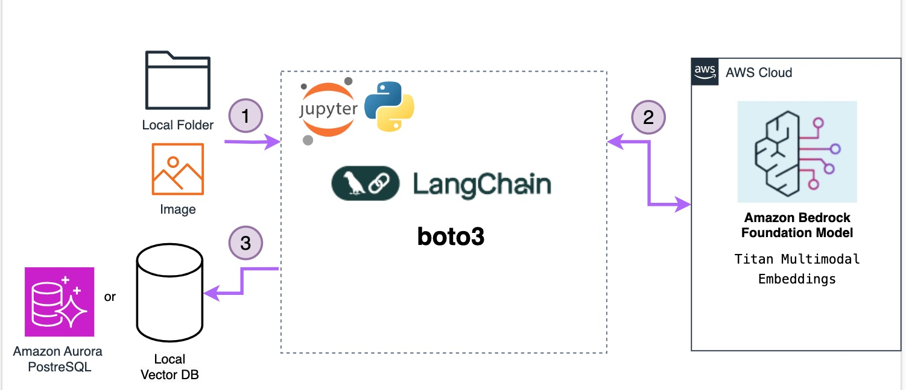

#  Building a Multimodal Search Engine for Text, Image, and Video Content.

> [Getting started with Amazon Bedrock, RAG, and Vector database in Python](https://github.com/build-on-aws/llm-rag-vectordb-python)

Learn how to build a comprehensive search engine that understands text, images, and video using [Amazon Titan Embeddings](https://docs.aws.amazon.com/bedrock/latest/userguide/titan-embedding-models.html), [Amazon Bedrock](https://aws.amazon.com/bedrock/), [Amazon Nova models](https://docs.aws.amazon.com/nova/) and [LangChain](https://python.langchain.com/docs/). 

Through Jupyter notebooks, the repository guides you through the process of [video understanding](https://docs.aws.amazon.com/nova/latest/userguide/modalities-video.html), ingesting text from PDFs, generating text and image embeddings, and segmenting the text into meaningful chunks using LangChain. These embeddings are then stored in a [FAISS](https://python.langchain.com/docs/integrations/vectorstores/faiss/) vector database and an [Amazon Aurora](https://aws.amazon.com/rds/aurora/) PostgreSQL database, enabling efficient search and retrieval operations.

Using Amazon Aurora PostgreSQL, you'll store and manage all vector embeddings in one place, making your content searchable through natural language queries.

## What You'll Build

This project guides you through creating:
- A text and document processing pipeline and image understanding and search system using [AWS Cloud Development Kit (CDK)](https://aws.amazon.com/cdk/) to create four [AWS Lambda Functions](https://aws.amazon.com/lambda/).
- A video content analysis solution with a unified vector database for semantic search using [AWS Cloud Development Kit (CDK)](https://aws.amazon.com/cdk/) to deploy  a scalable and modular architecture for processing audio/video content using [Amazon Elastic Container Service (ECS)](https://aws.amazon.com/ecs/).

## What You'll Learn

By completing this project, you'll know how to:
- Process and analyze text documents using Amazon Titan Embeddings
- Generate embeddings for images and enable visual search
- Extract insights from videos using Amazon Nova models
- Create semantic chunks from content using LangChain
- Build vector databases with FAISS and Aurora PostgreSQL
- Deploy serverless functions for content processing
- Implement multimodal search capabilities

Get ready to unlock the power of multi-modal search and unlock new possibilities in my apps!

## Jupyter notebooks

**Requirements**: 
- Install boto3 - This is the [AWS SDK for Python ](https://docs.aws.amazon.com/AmazonS3/latest/userguide/UsingTheBotoAPI.html)that allows interacting with AWS services. Install with `pip install boto3`.
- [Configure AWS credentials](https://docs.aws.amazon.com/braket/latest/developerguide/braket-using-boto3.html) - Boto3 needs credentials to make API calls to AWS.
- Install [Langchain](https://python.langchain.com/docs/get_started/introduction), a framework for developing applications powered by large language models (LLMs). Install with `pip install langchain`.

💰 **Cost to complete**: 
- [Amazon Bedrock Pricing](https://aws.amazon.com/bedrock/pricing/)
- [Amazon S3 Pricing](https://aws.amazon.com/s3/pricing/)
- [Amazon Aurora Pricing](https://aws.amazon.com/rds/aurora/pricing/)
- [Amazon Transcribe Pricing](https://aws.amazon.com/transcribe/pricing/)

### [Semantic Search with LangChain, Amazon Titan Embeddings, and FAISS](/notebooks/01_build_pdf_vector_db.ipynb):

Jupyter notebook for loading documents from PDFs, extracting and splitting text into semantically meaningful chunks using [LangChain](https://python.langchain.com/docs/get_started/introduction), generating text embeddings from those chunks utilizing an , generating embeddings from the text using an  [Amazon Titan Embeddings G1 - Text models](https://docs.aws.amazon.com/bedrock/latest/userguide/titan-embedding-models.html), and storing the embeddings in a [FAISS](https://python.langchain.com/docs/integrations/vectorstores/faiss/) vector database for retrieval.

### [Building a Multimodal Image Search App with Titan Embeddings and LangChain](/notebooks/02_build_images_vector_db.ipynb):

This notebook demonstrates how to combine [Titan Multimodal Embeddings](https://docs.aws.amazon.com/bedrock/latest/userguide/titan-multiemb-models.html), [LangChain](https://python.langchain.com/docs/get_started/introduction) and [FAISS](https://python.langchain.com/docs/integrations/vectorstores/faiss/) to build a capable image search application. Titan's embeddings allow representing images and text in a common dense vector space, enabling natural language querying of images. FAISS provides a fast, scalable way to index and search those vectors. And LangChain offers abstractions to hook everything together and surface relevant image results based on a user's query.

By following the steps outlined, you'll be able to preprocess images, generate embeddings, load them into FAISS, and write a simple application that takes in a natural language query, searches the FAISS index, and returns the most semantically relevant images. It's a great example of the power of combining modern AI technologies to build applications.

### [Supercharging Vector Similarity Search with Amazon Aurora and pgvector](/notebooks/03_build_pgvector_db.ipynb):

In this Jupyter Notebook, you'll explore how to store vector embeddings in a vector database using [Amazon Aurora](https://aws.amazon.com/es/rds/aurora/) and the pgvector extension. This approach is particularly useful for applications that require efficient similarity searches on high-dimensional data, such as natural language processing, image recognition, and recommendation systems.

### [Video Undestanding](/notebooks/04_video_understanding.ipynb):

This Jupyter notebook contains the code to process a video using [Amazon Nova models](https://docs.aws.amazon.com/nova/) to [video understanding](https://docs.aws.amazon.com/nova/latest/userguide/modalities-video.html). If the video is less than 25MB, it is converted to base64, and if it's larger, it is uploaded to an Amazon S3 bucket, which must be added as a variable in **you_bucket**. 

### [Video and Audio Content Analysis with Amazon Bedrock and Amazon Aurora PostgreSQL](/notebooks/05_create_audio_video_embeddings.ipynb):

This notebook demonstrates how to process video and audio content using Amazon Bedrock with [Amazon Titan Multimodal Embeddings G1 model](https://docs.aws.amazon.com/bedrock/latest/userguide/titan-multiemb-models.html) for generating embeddings and storing them in a existing Amazon Aurora PostgreSQL database with pgvector for similarity search capabilities.

> Create Amazon Aurora PostgreSQL with this [Amazon CDK Stack](../create-audio-video-embeddings/02-aurora-pg-vector/README.md)

## Serveless embeddings APPs

| App  |Description|Diagram|
|---|---|---|
|[Building an Amazon Aurora PostgreSQL vector database](/create-aurora-pgvector/README.md)|Learn how to set up an Amazon Aurora PostgreSQL vector database to multimodal vector embeddings, enabling semantic search, using AWS Cloud Development Kit (CDK) for Python.||
|[Serverless AWS Lamdba Vector Database System for Multi-Modal Document/Image Processing](/serveless-embeddings/README.md)|This serverless solution creates, manages, and queries vector databases for PDF documents and images with Amazon Bedrock embeddings. You can use FAISS vector stores or Aurora PostgreSQL with pgvector for efficient similarity searches across multiple data types.||
|[ Ask Your Video: Audio/Video Processing Pipeline with Vector Search](/create-audio-video-embeddings/README.md)|Build a serverless solution that processes video content and makes it searchable using natural language. This solution extracts meaningful information from both audio and video, allowing you to find specific moments using simple queries||

## 🚀 Some links for you to continue learning and building:

- [Getting started with Amazon Bedrock, RAG, and Vector database in Python](https://github.com/build-on-aws/llm-rag-vectordb-python)
- [Building with Amazon Bedrock and LangChain](https://catalog.workshops.aws/building-with-amazon-bedrock/en-US)
- [How To Choose Your LLM](https://community.aws/posts/how-to-choose-your-llm)
- [Working With Your Live Data Using LangChain](https://community.aws/posts/working-with-your-live-data-using-langchain)

----

## 🇻🇪🇨🇱 ¡Gracias!

---

## Security

See [CONTRIBUTING](CONTRIBUTING.md#security-issue-notifications) for more information.

## License

This library is licensed under the MIT-0 License. See the LICENSE file.

