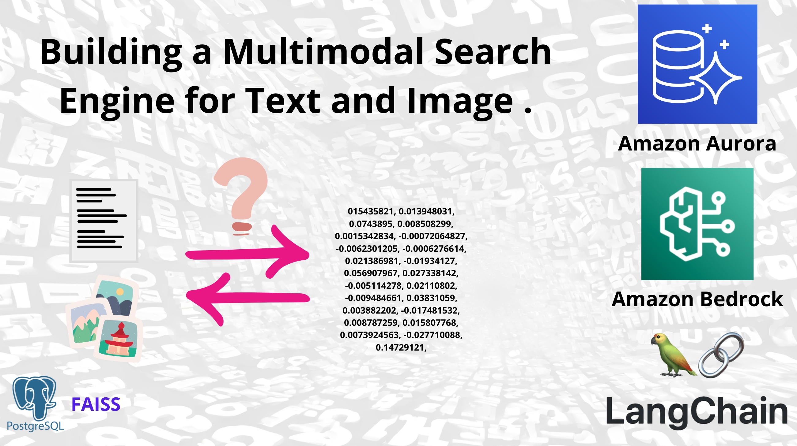
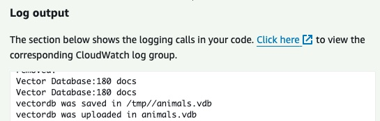
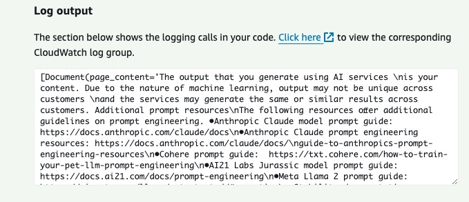

# Building a Multimodal Search Engine for Text and Image with Amazon Titan Embeddings, Amazon Bedrock, Amazon Aurora and LangChain.

This repository demonstrates how to build a multimodal search engine using [Amazon Titan Embeddings](https://docs.aws.amazon.com/bedrock/latest/userguide/titan-embedding-models.html), Amazon Bedrock, and [LangChain](https://python.langchain.com/docs/). It covers generating state-of-the-art text and image embeddings with Titan's models, enabling semantic search and retrieval capabilities. Through Jupyter notebooks, it guides you through loading text from PDFs, generating text embeddings, splitting text into meaningful chunks using LangChain, and storing these embeddings in a [FAISS](https://python.langchain.com/docs/integrations/vectorstores/faiss/) vector database and the PostgreSQL-compatible [Amazon Aurora](https://aws.amazon.com/rds/aurora/) PostgreSQL database for efficient search and retrieval operations.

In a second part you'll build a Serveless Embedding APP leverage [AWS Cloud Development Kit (CDK)](https://aws.amazon.com/cdk/) to create four [AWS Lambda Functions](https://aws.amazon.com/lambda/): two responsible for embedding text and image files, and two for retrieving documents based on text or image queries. These Lambda functions will be designed to be invoked through events invocations, providing a scalable and serverless solution for my multimodal search engine.

By the end of this post, I'll have a solid understanding of how to:

- Load PDF text and generate text/image embeddings using Amazon Titan Embeddings.
- Chunk text into semantic segments with LangChain.
- Create local FAISS vector databases for text and images.
- Build an image search app leveraging Titan Multimodal Embeddings.  
- Store vector embeddings in Amazon Aurora PostgreSQL with pgvector extension.
- Query vector databases for relevant text documents and images.
- Deploy Lambda functions for embedding/retrieval using AWS CDK.

Get ready to unlock the power of multi-modal search and unlock new possibilities in my apps!

## Jupyter notebooks


**Requirements**: 
- Install boto3 - This is the [AWS SDK for Python ](https://docs.aws.amazon.com/AmazonS3/latest/userguide/UsingTheBotoAPI.html)that allows interacting with AWS services. Install with `pip install boto3`.
- [Configure AWS credentials](https://docs.aws.amazon.com/braket/latest/developerguide/braket-using-boto3.html) - Boto3 needs credentials to make API calls to AWS.
- Install [Langchain](https://python.langchain.com/docs/get_started/introduction), a framework for developing applications powered by large language models (LLMs). Install with `pip install langchain`.

💰 **Cost to complete**: 
- [Amazon Bedrock Pricing](https://aws.amazon.com/bedrock/pricing/)

### [Semantic Search with LangChain, Amazon Titan Embeddings, and FAISS](/notebooks/01_build_pdf_vector_db.ipynb):

Jupyter notebook for loading documents from PDFs, extracting and splitting text into semantically meaningful chunks using [LangChain](https://python.langchain.com/docs/get_started/introduction), generating text embeddings from those chunks utilizing an , generating embeddings from the text using an  [Amazon Titan Embeddings G1 - Text models](https://docs.aws.amazon.com/bedrock/latest/userguide/titan-embedding-models.html), and storing the embeddings in a [FAISS](https://python.langchain.com/docs/integrations/vectorstores/faiss/) vector database for retrieval.

### [Building a Multimodal Image Search App with Titan Embeddings and LangChain](/notebooks/02_build_images_vector_db.ipynb):

This notebook demonstrates how to combine [Titan Multimodal Embeddings](https://docs.aws.amazon.com/bedrock/latest/userguide/titan-multiemb-models.html), [LangChain](https://python.langchain.com/docs/get_started/introduction) and [FAISS](https://python.langchain.com/docs/integrations/vectorstores/faiss/) to build a capable image search application. Titan's embeddings allow representing images and text in a common dense vector space, enabling natural language querying of images. FAISS provides a fast, scalable way to index and search those vectors. And LangChain offers abstractions to hook everything together and surface relevant image results based on a user's query.

By following the steps outlined, you'll be able to preprocess images, generate embeddings, load them into FAISS, and write a simple application that takes in a natural language query, searches the FAISS index, and returns the most semantically relevant images. It's a great example of the power of combining modern AI technologies to build applications.


### [Supercharging Vector Similarity Search with Amazon Aurora and pgvector](/notebooks/03_build_pgvector_db.ipynb):

In this Jupyter Notebook, you'll explore how to store vector embeddings in a vector database using [Amazon Aurora](https://aws.amazon.com/es/rds/aurora/) and the pgvector extension. This approach is particularly useful for applications that require efficient similarity searches on high-dimensional data, such as natural language processing, image recognition, and recommendation systems.

## Serveless Embedding APP

💰 **Cost to complete**: 
- [Amazon Bedrock Pricing](https://aws.amazon.com/bedrock/pricing/)
- [Amazon Lambda Pricing](https://aws.amazon.com/lambda/pricing/)
- [Amazon Aurora Pricing](https://aws.amazon.com/rds/aurora/pricing/)
- [Amazon S3 Pricing](https://aws.amazon.com/s3/pricing/)

In the second part, you'll construct a Serverless Embedding App utilizing the AWS Cloud Development Kit (CDK) to create four Lambda Functions. 

>Learn [how test Lambda Functions in the console](https://docs.aws.amazon.com/lambda/latest/dg/testing-functions.html) with test events. 

### AWS Lambda Funtions to Generating Embeddings for Text and Image Files:


To handle the embedding process, there is a dedicated Lambda Function for each file type:

- [To generate embeddings for the text content of PDF files with FAISS](serveless-embeddings/lambdas/code/build_pdf_vector_db/lambda_function.py). 

Event to trigger: 

```json
{
    "location": "REPLACE-YOU-KEY",
    "vectorStoreLocation": "REPALCE-NAME.vdb",
    "bucketName": "REPLACE-YOU-BUCKET",
    "vectorStoreType": "faiss",
    "splitStrategy": "semantic",
    "fileType": "application/pdf", 
    "embeddingModel": "amazon.titan-embed-text-v1"
  }
```
| Event  |Executing function: succeeded |
|---|---|
|||
|||

- [To generate embeddings for images with FAISS](serveless-embeddings/lambdas/code/build_image_vector_db/lambda_function.py).

Event to trigger: 

```json
{
    "location": "REPLACE-YOU-KEY-FOLDER",
    "vectorStoreLocation": "REPLACE-NAME.vdb",
    "bucketName": "REPLACE-YOU-BUCKET",
    "vectorStoreType": "faiss",
    "splitStrategy": "semantic",
    "embeddingModel": "amazon.titan-embed-image-v1"
  }
```

| Event  |Executing function: succeeded |
|---|---|
|||
|||

- [To generate embeddings for image/pdf with pgvector and Amazon Aurora](serveless-embeddings/lambdas/code/build_aurora_postgre_vector_db/lambda_function.py).


> 💡 Before testing this Lambda Function keep in mind that it must be in the same VPC and be able to access the Amazon Aurora PostreSQL DB, for that check [Automatically connecting a Lambda function and an Aurora DB cluster](https://docs.aws.amazon.com/AmazonRDS/latest/AuroraUserGuide/lambda-rds-connect.html), [Using Amazon RDS Proxy for Aurora](https://docs.aws.amazon.com/AmazonRDS/latest/AuroraUserGuide/rds-proxy.html) and [Use interface VPC endpoints (AWS PrivateLink)](https://docs.aws.amazon.com/bedrock/latest/userguide/usingVPC.html#vpc-interface-endpoints) for Amazon Bedrock VPC endpoint. 

Event to trigger: 

```json
{
  "location": "YOU-KEY",
  "bucketName": "YOU-BUCKET-NAME",
  "fileType": "pdf or image",
  "embeddingModel": "amazon.titan-embed-text-v1", 
  "PGVECTOR_USER":"YOU-RDS-USER",
  "PGVECTOR_PASSWORD":"YOU-RDS-PASSWORD",
  "PGVECTOR_HOST":"YOU-RDS-ENDPOINT-PROXY",
  "PGVECTOR_DATABASE":"YOU-RDS-DATABASE",
  "PGVECTOR_PORT":"5432",
  "collectioName": "YOU-collectioName",
  "bedrock_endpoint": "https://vpce-...-.....bedrock-runtime.YOU-REGION.vpce.amazonaws.com"
}
```

| Event PDF  |Executing function: succeeded |
|---|---|
|||
|||

| Event Image  |Executing function: succeeded |
|---|---|
|||
|||

### AWS Lambda Funtions to Query for Text and Image Files in a Vector DB:


To handle the embedding process, there is a dedicated Lambda Function for each file type:

- [To retrieval text content from a vector DB](serveless-embeddings/lambdas/code/pdf_retriever_lambda/lambda_function.py)

Event to trigger: 

```json
{
  "vectorStoreLocation": "REPLACE-NAME.vdb",
  "bucketName": "REPLACE-YOU-BUCKET",
  "vectorStoreType": "faiss",
  "query": "YOU-QUERY",
  "numDocs": 5,
  "embeddingModel": "amazon.titan-embed-text-v1"
}

```
| Event  |Executing function: succeeded |
|---|---|
|||
|||

- [To retrieval image location from a vector DB](serveless-embeddings/lambdas/code/pdf_retriever_lambda/lambda_function.py)

You can search by text or by image

- Text event to trigger
```json
{
  "vectorStoreLocation": "REPLACE-NAME.vdb",
  "bucketName": "REPLACE-YOU-BUCKET",
  "vectorStoreType": "faiss",
  "InputType": "text",
  "query":"TEXT-QUERY",
  "embeddingModel": "amazon.titan-embed-text-v1"
}
```

| Event  |Executing function: succeeded |
|---|---|
|||
|||

- Image event to trigger
```json
{
  "vectorStoreLocation": "REPLACE-NAME.vdb",
  "bucketName": "REPLACE-YOU-BUCKET",
  "vectorStoreType": "faiss",
  "InputType": "image",
  "query":"IMAGE-BUCKET-LOCATION-QUERY",
  "embeddingModel": "amazon.titan-embed-text-v1"
}
```
| Event  |Executing function: succeeded |
|---|---|
|||
|||

> 💡 The next step is to take the `image_path` value and download the file from Amazon S3 bucket with a [download_file boto3](https://boto3.amazonaws.com/v1/documentation/api/latest/guide/s3-example-download-file.html) method. 

- [To generate embeddings for image/pdf with pgvector and Amazon Aurora](serveless-embeddings/lambdas/code/build_aurora_postgre_vector_db/lambda_function.py).


```json
{
  "location": "YOU-KEY",
  "bucketName": "YOU-BUCKET-NAME",
  "fileType": "pdf or image",
  "embeddingModel": "amazon.titan-embed-text-v1", 
  "PGVECTOR_USER":"YOU-RDS-USER",
  "PGVECTOR_PASSWORD":"YOU-RDS-PASSWORD",
  "PGVECTOR_HOST":"YOU-RDS-ENDPOINT-PROXY",
  "PGVECTOR_DATABASE":"YOU-RDS-DATABASE",
  "PGVECTOR_PORT":"5432",
  "collectioName": "YOU-collectioName",
  "bedrock_endpoint": "https://vpce-...-.....bedrock-runtime.YOU-REGION.vpce.amazonaws.com",
  "QUERY": "YOU-TEXT-QUESTION"
  }
```

> 💡 Use `location` and `bucketName`to deliver image location to make a query.

| Event PDF  |Executing function: succeeded |
|---|---|
|||
|||

| Event Image Query Text  |Executing function: succeeded |
|---|---|
|||
|||

| Event Image Query Image |Executing function: succeeded |
|---|---|
|||
|||

### 🚀 Let's build!

The Amazon Lambdas that you build in this deployment are created with a [container images](https://docs.aws.amazon.com/lambda/latest/dg/images-create.html), you must have [Docker Desktop](https://www.docker.com/products/docker-desktop/) installed and active in your computer. 

**Step 1:  APP Set Up**

✅ Clone the repo

```
git clone https://github.com/build-on-aws/langchain-embeddings
```

✅ Go to: 

```
cd serveless-embeddings
```

- Configure the [AWS Command Line Interface](https://docs.aws.amazon.com/cli/latest/userguide/cli-chap-configure.html)

- Deploy architecture with CDK [Follow steps:](/private-assistant/README.md)

**Step 2: Deploy architecture with CDK.**

✅ Create The Virtual Environment: by following the steps in the [README](/private-assistant/README.md)

```
python3 -m venv .venv
```

```
source .venv/bin/activate
```
for windows: 

```
.venv\Scripts\activate.bat
```

✅ Install The Requirements:

```
pip install -r requirements.txt
```

✅ Synthesize The Cloudformation Template With The Following Command:

```
cdk synth
```

✅🚀 The Deployment:

```
cdk deploy
```

**🧹 Clean the house!:**

If you finish testing and want to clean the application, you just have to follow these two steps:

1. Delete the files from the Amazon S3 bucket created in the deployment. 
2. Run this command in your terminal:

```
cdk destroy
```

## Conclusion:

In this post, you built a powerful multimodal search engine capable of handling both text and images using Amazon Titan Embeddings, Amazon Bedrock, Amazon Aurora PostgreSQL, and LangChain. You generated embeddings, stored the data in both FAISS vector databases and Amazon Aurora Postgre, and developed applications for semantic text and image search.

Additionally, you deployed a serverless application using AWS CDK with Lambda Functions to integrate embedding and retrieval capabilities through events, providing a scalable solution.

Now you have the tools to create your own multimodal search engines, unlocking new possibilities for your applications. Explore the code, experiment, and share your experiences in the comments.

## 🚀 Some links for you to continue learning and building:

- [Building with Amazon Bedrock and LangChain](https://catalog.workshops.aws/building-with-amazon-bedrock/en-US)
- [How To Choose Your LLM](https://community.aws/posts/how-to-choose-your-llm)
- [Working With Your Live Data Using LangChain](https://community.aws/posts/working-with-your-live-data-using-langchain)


----

## 🇻🇪🇨🇱 ¡Gracias!

---

## Security

See [CONTRIBUTING](CONTRIBUTING.md#security-issue-notifications) for more information.

## License

This library is licensed under the MIT-0 License. See the LICENSE file.

