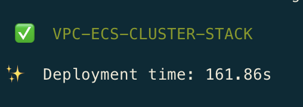
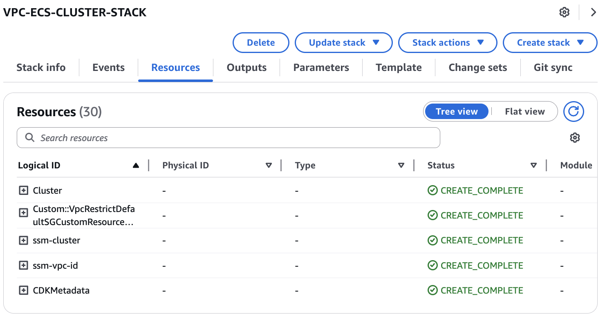

# Amazon ECS Cluster for Audio/Video Embeddings Processing

This CDK project creates the foundational infrastructure for an audio and video processing application that generates embeddings from media files. The infrastructure includes:

- An Amazon ECS (Elastic Container Service) cluster named "video-processing"
- A VPC with public and private subnets for secure networking
- SSM parameters to store cluster and VPC information for use by other stacks

## Application Overview

This stack is the first component of a multi-stack application designed to process audio and video files to create embeddings. Embeddings are numerical representations of media content that can be used for:

- Content-based search and retrieval
- Similarity detection
- Classification and categorization
- Recommendation systems

The ECS cluster created by this stack will host containerized applications that perform:
- Media file extraction and processing
- Feature extraction from audio/video content
- Embedding generation using machine learning models
- Storage and indexing of the resulting embeddings

## Prerequisites

- AWS CLI configured with appropriate credentials
- Python 3.8 or later
- Node.js 14.x or later (for CDK)
- AWS CDK Toolkit installed (`npm install -g aws-cdk`)
- Docker (for local testing if needed)

## Project Setup

The initialization process creates a virtualenv within this project, stored under the `.venv` directory.

### Create and Activate Virtual Environment

**MacOS/Linux:**

```bash
# Create virtual environment
python3 -m venv .venv

# Activate virtual environment
source .venv/bin/activate
```

**Windows:**

```cmd
# Create virtual environment
python -m venv .venv

# Activate virtual environment
.venv\Scripts\activate.bat
```

### Install Dependencies

Once the virtualenv is activated, install the required dependencies:

```bash
pip install -r requirements.txt
```

## Deployment

### Bootstrap Your AWS Environment (First-time only)

If you haven't used CDK in your AWS account/region before:

```bash
cdk bootstrap aws://ACCOUNT-NUMBER/REGION
```

Replace `ACCOUNT-NUMBER` with your AWS account ID and `REGION` with your desired AWS region (e.g., us-east-1).

### Configure Deployment Region (Optional)

By default, the application deploys to the us-east-1 region. To deploy to a different region:

```bash
export AWS_DEFAULT_REGION=your-preferred-region
```

### Deploy the ECS Cluster

```bash
# Synthesize CloudFormation template to review changes
cdk synth

# Deploy the stack
cdk deploy
```

During deployment, you'll be prompted to confirm the IAM changes. Review them and type 'y' to proceed.

This deployment takes approximately 162 seg.



This stack stores in AWS Systems Manager the cluster name and VPC ID values ​​needed to deploy other stacks that are part of this application.

```python
ssm.StringParameter( self, "ssm-cluster", parameter_name="/videopgvector/ecs-cluster-name", string_value=ecs_cluster.cluster_name)

ssm.StringParameter( self, "ssm-vpc-id", parameter_name="/videopgvector/ecs-vpc-id", string_value=ecs_cluster.vpc.vpc_id)
```

### Verify Deployment

After deployment, you can verify the resources in the AWS Management Console:
- ECS cluster named "video-processing" in the ECS console
- A new VPC with public and private subnets in the VPC console
- SSM parameters in the Systems Manager Parameter Store:
  - `videopgvector/cluster-name`: Contains the ECS cluster name
  - `videopgvector/vpc-id`: Contains the VPC ID




## Architecture Details

This stack creates the foundational infrastructure for the audio/video processing application:

1. **ECS Cluster**: A logical grouping of tasks or services that will run the containerized applications for processing media files
2. **VPC**: A virtual network with:
   - Public subnets for internet-facing components
   - Private subnets for secure processing
   - NAT gateways for outbound internet access from private subnets
3. **SSM Parameters**: Stored references that allow other stacks to find and use these resources

## Cost Considerations

This stack creates resources that may incur AWS charges:
- VPC with NAT Gateways (hourly cost + data processing)
- ECS Cluster (no charge for the cluster itself, but tasks/services will incur costs)

Consider using the AWS Pricing Calculator to estimate costs before deployment.

## Useful Commands

* `cdk ls`          List all stacks in the app
* `cdk synth`       Emits the synthesized CloudFormation template
* `cdk deploy`      Deploy this stack to your default AWS account/region
* `cdk diff`        Compare deployed stack with current state
* `cdk docs`        Open CDK documentation
* `cdk destroy`     Remove the stack from your account/region when no longer needed

## Next Steps

After deploying this infrastructure stack, you can:
1. Deploy task definitions and services to the ECS cluster
2. Configure your audio/video processing containers
3. Set up the necessary IAM roles and permissions
4. Deploy additional stacks for storage, processing, and API access

## Troubleshooting

If you encounter issues during deployment:

1. Check your AWS credentials and permissions
2. Verify that you have the correct CDK version installed
3. Review the CloudFormation events in the AWS Console for detailed error messages
4. Ensure you have sufficient service quotas for the resources being created

## Contributing

Please refer to the project's main README for contribution guidelines.

## Security

This infrastructure is designed with security best practices in mind:
- Private subnets for processing tasks
- Least privilege IAM permissions
- No direct internet access to processing containers

## License

This library is licensed under the MIT-0 License. See the LICENSE file.

---

*This README was generated and improved with Amazon Q CLI.*
