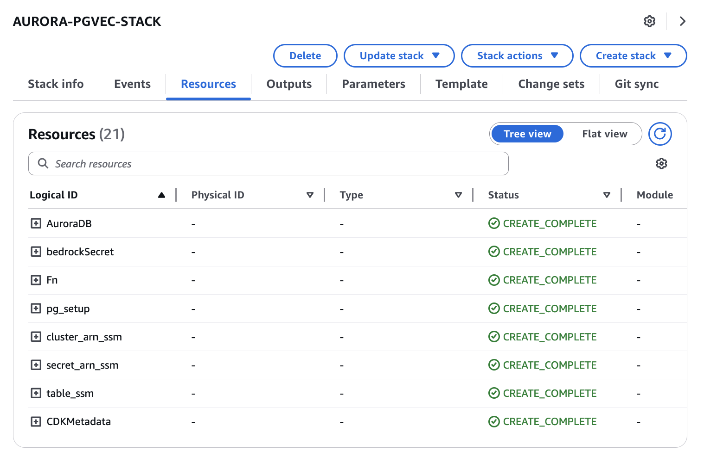

# Amazon Aurora PostgreSQL Vector Database for Audio/Video Embeddings

This CDK project creates an Amazon Aurora PostgreSQL database with vector capabilities for storing and querying embeddings generated from audio and video files. The infrastructure includes:

- An Aurora PostgreSQL Serverless v2 cluster with pgvector extension
- Lambda functions for database setup and management
- Security groups and IAM roles for secure access
- SSM parameters to store database connection information

This is the second component of the audio/video embeddings processing application, following the ECS cluster setup.

## Application Overview

This stack creates a vector database that will store embeddings generated from audio and video files. The database:

- Uses the pgvector extension to enable vector operations
- Creates tables optimized for vector similarity searches
- Configures HNSW (Hierarchical Navigable Small World) indexes for efficient similarity queries
- Sets up necessary roles and permissions for secure access

The Aurora PostgreSQL database will store:
- Vector embeddings (numerical representations of media content)
- Metadata about the original media files
- Text chunks extracted from audio/video content
- References to source files

## Prerequisites

- AWS CLI configured with appropriate credentials
- Python 3.8 or later
- Node.js 14.x or later (for CDK)
- AWS CDK Toolkit installed (`npm install -g aws-cdk`)
- The ECS cluster stack (01-ecs-cluster) must be deployed first

## Project Setup

The initialization process creates a virtualenv within this project, stored under the `.venv` directory.

### Create and Activate Virtual Environment

**MacOS/Linux:**

```bash
# Create virtual environment
python3 -m venv .venv

# Activate virtual environment
source .venv/bin/activate
```

**Windows:**

```cmd
# Create virtual environment
python -m venv .venv

# Activate virtual environment
.venv\Scripts\activate.bat
```

### Install Dependencies

Once the virtualenv is activated, install the required dependencies:

```bash
pip install -r requirements.txt
```

## Deployment

### Bootstrap Your AWS Environment (First-time only)

If you haven't used CDK in your AWS account/region before:

```bash
cdk bootstrap aws://ACCOUNT-NUMBER/REGION
```

Replace `ACCOUNT-NUMBER` with your AWS account ID and `REGION` with your desired AWS region (e.g., us-east-1).

### Configure Deployment Region (Optional)

By default, the application deploys to the us-east-1 region. To deploy to a different region:

```bash
export AWS_DEFAULT_REGION=your-preferred-region
```

### Deploy the Aurora PostgreSQL Vector Database

```bash
# Synthesize CloudFormation template to review changes
cdk synth

# Deploy the stack
cdk deploy
```

During deployment, you'll be prompted to confirm the IAM changes. Review them and type 'y' to proceed.

This deployment takes approximately 594.29s.


This stack stores in AWS Systems Manager the cluster arn, secret arn and video table name values ​​needed to deploy other stacks that are part of this application.

### Verify Deployment

After deployment, you can verify the resources in the AWS Management Console:
- Aurora PostgreSQL cluster in the RDS console
- Lambda functions in the Lambda console
- SSM parameters in the Systems Manager Parameter Store:
  - `/videopgvector/cluster_arn`: Contains the Aurora cluster ARN
  - `/videopgvector/secret_arn`: Contains the secret ARN for database credentials
  - `/videopgvector/video_table_name`: Contains the table name for video embeddings



## Architecture Details

This stack creates the following components:

1. **Aurora PostgreSQL Serverless v2 Cluster**: A scalable database optimized for vector operations
2. **Lambda Functions**:
   - `table_creator`: Sets up the database schema, extensions, and tables
3. **Security Groups**: Control network access to the database
4. **IAM Roles and Policies**: Provide secure access to AWS resources
5. **SSM Parameters**: Store references to database resources for use by other stacks

## Database Schema

The main table (`knowledge_bases`) includes the following columns:
- `id`: UUID primary key
- `embedding`: Vector representation (1024 dimensions)
- `chunks`: Text content
- `time`: Integer timestamp
- `metadata`: JSON object with additional information
- `date`: Date string
- `source`: Source identifier
- `sourceurl`: URL to the source content
- `topic`: Topic categorization
- `content_type`: Type of content
- `language`: Language identifier

An HNSW index is created on the embedding column for efficient similarity searches.

## Cost Considerations

This stack creates resources that may incur AWS charges:
- Aurora PostgreSQL Serverless v2 (charged based on ACU usage)
- Lambda function invocations
- Data transfer and storage

Consider using the AWS Pricing Calculator to estimate costs before deployment.

## Useful Commands

* `cdk ls`          List all stacks in the app
* `cdk synth`       Emits the synthesized CloudFormation template
* `cdk deploy`      Deploy this stack to your default AWS account/region
* `cdk diff`        Compare deployed stack with current state
* `cdk docs`        Open CDK documentation
* `cdk destroy`     Remove the stack from your account/region when no longer needed

## Next Steps

After deploying this database stack, you can:
1. Deploy the audio/video processing workflow (03-audio-video-workflow)
2. Configure the embedding generation process
3. Set up retrieval mechanisms for the stored embeddings

## Troubleshooting

If you encounter issues during deployment:

1. Check your AWS credentials and permissions
2. Verify that the ECS cluster stack was deployed successfully
3. Review the CloudFormation events in the AWS Console for detailed error messages
4. Check Lambda function logs in CloudWatch Logs

## Security

This infrastructure is designed with security best practices in mind:
- Database deployed in private subnets
- Least privilege IAM permissions
- Secure credential management using AWS Secrets Manager
- Network access control via security groups

## License

This library is licensed under the MIT-0 License. See the LICENSE file.

---

*This README was generated and improved with Amazon Q CLI.*
