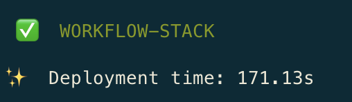
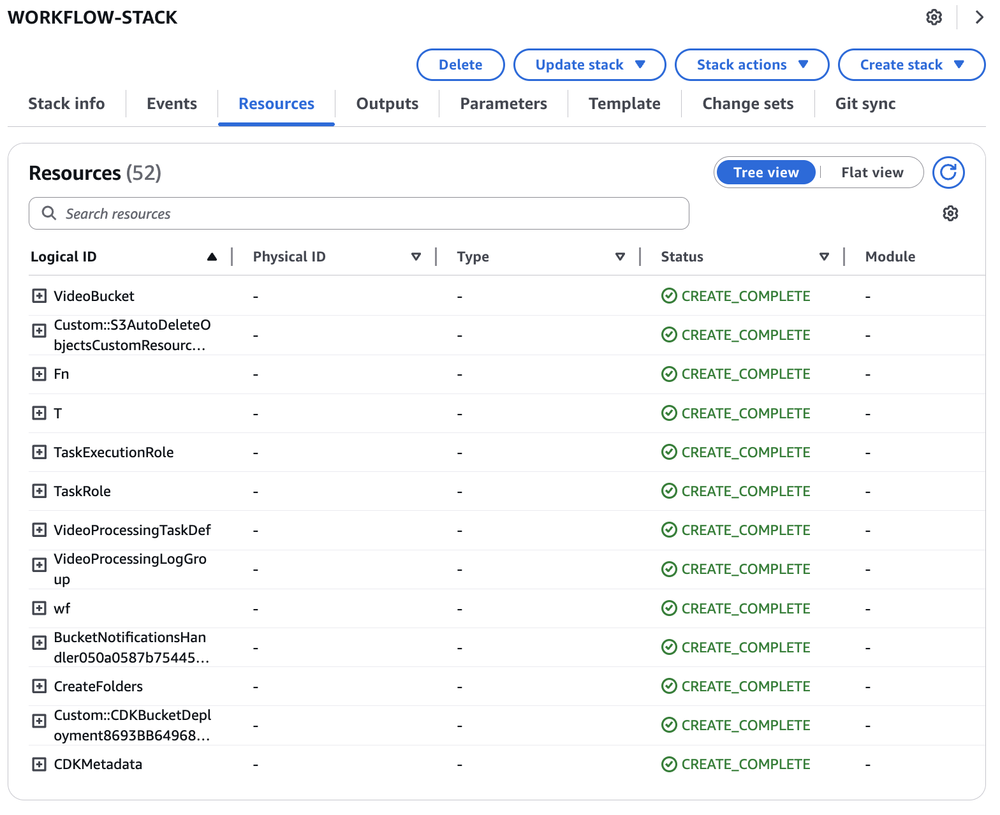

# Audio/Video Processing Workflow

This CDK project creates a complete workflow for processing audio and video files to generate embeddings. The infrastructure includes:

- A Step Functions workflow that orchestrates the entire process
- Lambda functions for various processing steps
- An ECS Fargate task for video frame extraction
- Integration with Amazon Transcribe for audio transcription
- DynamoDB tables for tracking job status
- S3 bucket for storing media files and processing results

This is the third component of the audio/video embeddings processing application, following the ECS cluster and Aurora PostgreSQL vector database setup.

## Application Overview

This stack creates a serverless workflow that processes uploaded audio and video files to extract meaningful information and generate embeddings. The workflow:

1. Triggers automatically when files are uploaded to the S3 bucket
2. Processes video files to extract key frames using computer vision techniques
3. Transcribes audio content using Amazon Transcribe
4. Generates embeddings from both visual and audio content
5. Stores the embeddings in the Aurora PostgreSQL vector database

The workflow runs in parallel to efficiently process both the visual and audio components of media files.

## Key Components

- **Step Functions Workflow**: Orchestrates the entire processing pipeline
- **ECS Fargate Task**: Processes video files to extract key frames
- **Lambda Functions**:
  - `s3_trigger`: Initiates the workflow when files are uploaded
  - `start_transcribe`: Starts Amazon Transcribe jobs
  - `process_transcribe`: Processes transcription results
  - `process_results`: Combines video and audio processing results
- **DynamoDB Tables**: Track job status and metadata
- **S3 Bucket**: Stores media files and processing results

## Prerequisites

- AWS CLI configured with appropriate credentials
- Python 3.8 or later
- Node.js 14.x or later (for CDK)
- AWS CDK Toolkit installed (`npm install -g aws-cdk`)
- The ECS cluster stack (01-ecs-cluster) must be deployed first
- The Aurora PostgreSQL vector database stack (02-aurora-pg-vector) must be deployed second

## Project Setup

The initialization process creates a virtualenv within this project, stored under the `.venv` directory.

### Create and Activate Virtual Environment

**MacOS/Linux:**

```bash
# Create virtual environment
python3 -m venv .venv

# Activate virtual environment
source .venv/bin/activate
```

**Windows:**

```cmd
# Create virtual environment
python -m venv .venv

# Activate virtual environment
.venv\Scripts\activate.bat
```

### Install Dependencies

Once the virtualenv is activated, install the required dependencies:

```bash
pip install -r requirements.txt
```

## Deployment

### Bootstrap Your AWS Environment (First-time only)

If you haven't used CDK in your AWS account/region before:

```bash
cdk bootstrap aws://ACCOUNT-NUMBER/REGION
```

Replace `ACCOUNT-NUMBER` with your AWS account ID and `REGION` with your desired AWS region (e.g., us-east-1).

### Configure Deployment Region (Optional)

By default, the application deploys to the us-east-1 region. To deploy to a different region:

```bash
export AWS_DEFAULT_REGION=your-preferred-region
```

### Deploy the Workflow Stack

```bash
# Synthesize CloudFormation template to review changes
cdk synth

# Deploy the stack
cdk deploy
```

During deployment, you'll be prompted to confirm the IAM changes. Review them and type 'y' to proceed.



### Verify Deployment

After deployment, you can verify the resources in the AWS Management Console:
- Step Functions workflow in the Step Functions console
- Lambda functions in the Lambda console
- ECS task definition in the ECS console
- S3 bucket in the S3 console
- DynamoDB tables in the DynamoDB console



## Using the Workflow

To process a media file:

1. Upload an audio or video file to the S3 bucket in the `voice/` prefix
2. The workflow will automatically start processing the file
3. Monitor the workflow execution in the Step Functions console
4. Once complete, the embeddings will be stored in the Aurora PostgreSQL database
5. Key frames from videos will be stored in the S3 bucket under the `selected_frames/` prefix

## Architecture Details

This stack creates a serverless workflow with the following components:

1. **S3 Bucket**: Stores media files and processing results
2. **Step Functions Workflow**:
   - Parallel processing of video and audio content
   - Coordination of all processing steps
   - Error handling and retries
3. **ECS Fargate Task**:
   - Extracts frames from video files
   - Generates embeddings for visual content
   - Identifies key frames based on visual similarity
4. **Lambda Functions**:
   - Trigger workflow on S3 uploads
   - Manage Amazon Transcribe jobs
   - Process transcription results
   - Store embeddings in the database
5. **DynamoDB Tables**: Track job status and metadata

## Video Processing Container

The video processing container:
- Uses FFmpeg to extract frames from videos
- Generates embeddings for each frame
- Identifies key frames based on visual similarity
- Uploads selected frames back to S3

## Cost Considerations

This stack creates resources that may incur AWS charges:
- Step Functions workflow executions
- Lambda function invocations
- ECS Fargate task executions
- Amazon Transcribe jobs
- S3 storage and data transfer
- DynamoDB read/write capacity

Consider using the AWS Pricing Calculator to estimate costs before deployment.

## Useful Commands

* `cdk ls`          List all stacks in the app
* `cdk synth`       Emits the synthesized CloudFormation template
* `cdk deploy`      Deploy this stack to your default AWS account/region
* `cdk diff`        Compare deployed stack with current state
* `cdk docs`        Open CDK documentation
* `cdk destroy`     Remove the stack from your account/region when no longer needed

## Next Steps

After deploying this workflow stack, you can:
1. Deploy the retrieval stack (04-retrieval) to enable searching and querying the embeddings
2. Customize the workflow to support additional media formats
3. Enhance the embedding generation process for specific use cases
4. Implement additional processing steps for specialized requirements

## Troubleshooting

If you encounter issues during deployment:

1. Check your AWS credentials and permissions
2. Verify that the prerequisite stacks were deployed successfully
3. Review the CloudFormation events in the AWS Console for detailed error messages
4. Check the CloudWatch Logs for Lambda functions and Step Functions executions

## Security

This infrastructure is designed with security best practices in mind:
- Least privilege IAM permissions
- Secure credential management
- Network isolation for processing tasks
- Encryption for data at rest and in transit

## License

This library is licensed under the MIT-0 License. See the LICENSE file.

---

*This README was generated and improved with Amazon Q CLI.*
