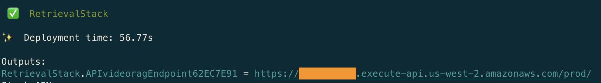
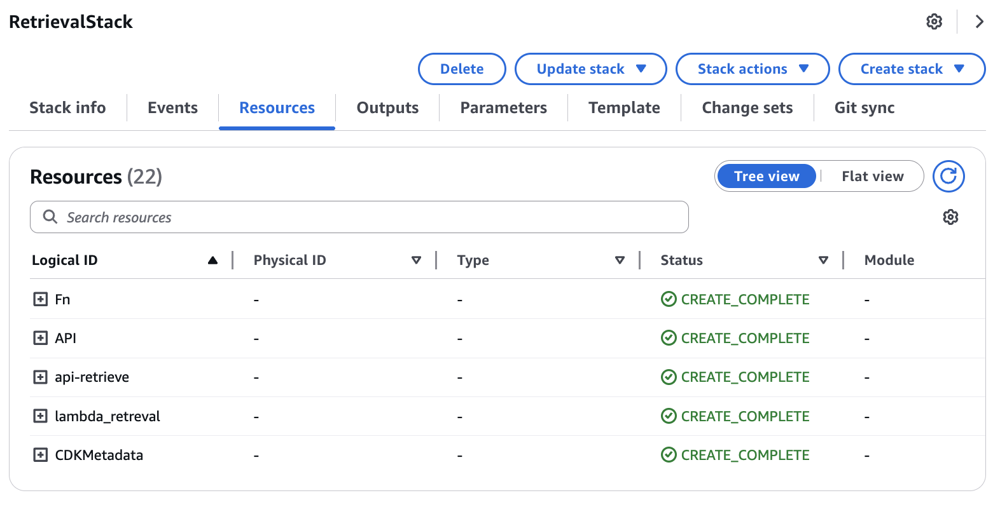

# Retrieval API for Audio/Video Embeddings

This CDK project creates a retrieval API for searching and querying embeddings generated from audio and video files. The infrastructure includes:

- An API Gateway REST API with Cognito authentication
- Lambda functions for retrieval operations
- Integration with the Aurora PostgreSQL vector database
- User authentication and authorization via Amazon Cognito (optional)

This is the fourth and final component of the audio/video embeddings processing application, following the ECS cluster, Aurora PostgreSQL vector database, and audio/video workflow stacks.

## Application Overview

This stack creates a secure API that allows users to search and retrieve information from the audio and video embeddings stored in the Aurora PostgreSQL vector database. The API supports:

- Semantic search using vector similarity
- Multimodal retrieval (text and images)
- Filtering by content type and source
- Integration with Amazon Bedrock for generative AI responses

The retrieval system enables users to:
- Find relevant content based on natural language queries
- Retrieve specific segments of audio/video content
- Generate AI-powered responses based on the retrieved content
- Access content through a secure, authenticated API

## Key Components

- **API Gateway**: Provides REST API endpoints for retrieval operations
- **Lambda Functions**: Process retrieval requests and generate responses
- **Integration with Aurora PostgreSQL**: Performs vector similarity searches
- **Amazon Bedrock Integration**: Generates AI responses based on retrieved content

## Prerequisites

- AWS CLI configured with appropriate credentials
- Python 3.8 or later
- Node.js 14.x or later (for CDK)
- AWS CDK Toolkit installed (`npm install -g aws-cdk`)
- The previous stacks must be deployed in this order:
  1. ECS cluster (01-ecs-cluster)
  2. Aurora PostgreSQL vector database (02-aurora-pg-vector)
  3. Audio/video workflow (03-audio-video-workflow)

## Project Setup

The initialization process creates a virtualenv within this project, stored under the `.venv` directory.

### Create and Activate Virtual Environment

**MacOS/Linux:**

```bash
# Create virtual environment
python3 -m venv .venv

# Activate virtual environment
source .venv/bin/activate
```

**Windows:**

```cmd
# Create virtual environment
python -m venv .venv

# Activate virtual environment
.venv\Scripts\activate.bat
```

### Install Dependencies

Once the virtualenv is activated, install the required dependencies:

```bash
pip install -r requirements.txt
```

## Deployment


### Configure Deployment Region (Optional)

By default, the application deploys to the us-east-1 region. To deploy to a different region:

```bash
export AWS_DEFAULT_REGION=your-preferred-region
```

### Deploy the Retrieval API Stack

```bash
# Synthesize CloudFormation template to review changes
cdk synth

# Deploy the stack
cdk deploy
```

During deployment, you'll be prompted to confirm the IAM changes. Review them and type 'y' to proceed.

  

### Verify Deployment

After deployment, you can verify the resources in the AWS Management Console:
- API Gateway REST API in the API Gateway console
- Lambda functions in the Lambda console
- Cognito user pool in the Cognito console
- SSM parameters in the Systems Manager Parameter Store:
  - `/videopgvector/api_retrieve`: Contains the API endpoint URL
  - `/videopgvector/lambda_retreval_name`: Contains the retrieval Lambda function name
  
  

## Using the API

### Making API Requests

The API supports the following endpoints:

#### POST /retrieve

Retrieves relevant content based on a query.

**Request Body:**
```json
{
  "query": "Your search query here",
  "video_id": "optional-video-id",
  "content_type": "optional-content-type",
  "how": "cosine",
  "k": 5
}
```

**Parameters:**
- `query`: The search query text
- `video_id` (optional): Filter results by specific video ID
- `content_type` (optional): Filter by content type (text or image)
- `how`: Similarity method (cosine or l2)
- `k`: Number of results to return

**Response:**
```json
{
  "docs": [
    {
      "page_content": "Content text or image URL",
      "metadata": {
        "source": "Source identifier",
        "content_type": "text or image",
        "similarity": 0.95
      }
    }
  ]
}
```

#### POST /retrieve (with method=retrieve_generate)

Retrieves content and generates an AI response.

**Request Body:**
```json
{
  "method": "retrieve_generate",
  "query": "Your question here",
  "video_id": "optional-video-id",
  "model_id": "us.amazon.nova-pro-v1:0"
}
```

**Additional Parameters:**
- `method`: Set to "retrieve_generate" to use this endpoint
- `model_id`: Amazon Bedrock model ID to use for response generation

**Response:**
```json
{
  "response": "AI-generated response based on retrieved content",
  "docs": "Retrieved documents used for generation"
}
```

## Architecture Details

This stack creates a serverless API with the following components:

1. **API Gateway REST API**: Provides HTTP endpoints for retrieval operations
2. **Lambda Functions**:
   - `retrieval`: Performs vector similarity searches and generates responses
4. **Integration with Aurora PostgreSQL**: Executes vector similarity searches
5. **Integration with Amazon Bedrock**: Generates AI responses based on retrieved content

## Cost Considerations

This stack creates resources that may incur AWS charges:
- API Gateway requests
- Lambda function invocations
- Cognito user pool operations
- Amazon Bedrock model invocations

Consider using the AWS Pricing Calculator to estimate costs before deployment.

## Useful Commands

* `cdk ls`          List all stacks in the app
* `cdk synth`       Emits the synthesized CloudFormation template
* `cdk deploy`      Deploy this stack to your default AWS account/region
* `cdk diff`        Compare deployed stack with current state
* `cdk docs`        Open CDK documentation
* `cdk destroy`     Remove the stack from your account/region when no longer needed

## Next Steps

After deploying this retrieval API stack, you can:
1. Develop a frontend application to interact with the API
2. Enhance the retrieval logic for specific use cases
3. Implement additional API endpoints for specialized queries
4. Integrate with other AWS services for extended functionality

## Troubleshooting

If you encounter issues during deployment:

1. Check your AWS credentials and permissions
2. Verify that the prerequisite stacks were deployed successfully
3. Review the CloudFormation events in the AWS Console for detailed error messages
4. Check the CloudWatch Logs for Lambda functions and API Gateway

## Security

This infrastructure is designed with security best practices in mind:
- API authentication using Cognito
- Least privilege IAM permissions
- Secure credential management
- Encryption for data at rest and in transit

Review the generated CloudFormation template before deployment to ensure it meets your security requirements.
