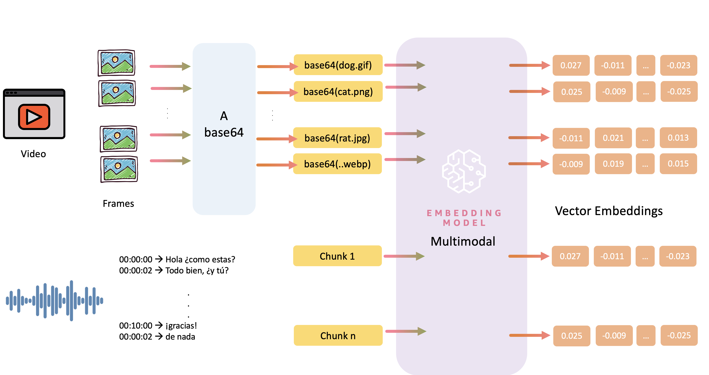
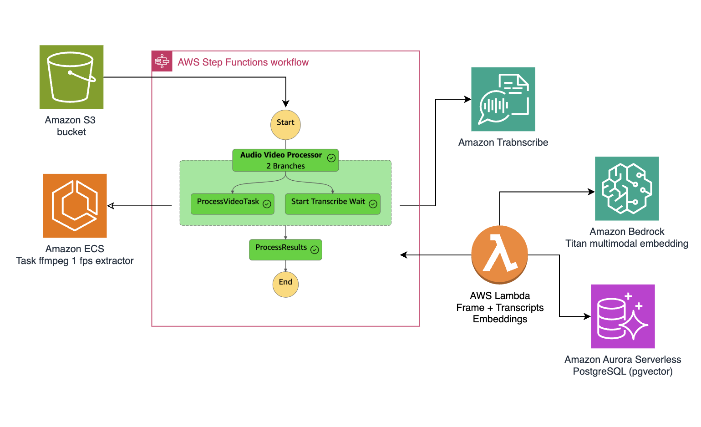

# Ask Your Video: Audio/Video Processing Pipeline with Vector Search

> This documentation was created with the help of [Generating documentation with Amazon Q Developer](https://docs.aws.amazon.com/amazonq/latest/qdeveloper-ug/doc-generation.html)

Build a serverless solution that processes video content and makes it searchable using natural language. This solution extracts meaningful information from both audio and video, allowing you to find specific moments using simple queries. The app stores all vector information in Amazon Aurora PostgreSQL with pgvector, enabling combined semantic searches across visual and audio content. This project uses four AWS CDK stacks to create a complete video processing and search solution.



## Architecture Overview

This project implements a scalable and modular architecture for processing audio/video content using:
- [Amazon Elastic Container Service (ECS)](https://aws.amazon.com/ecs/) to handle compute-intensive video processing
- [Amazon Aurora PostgreSQL](https://docs.aws.amazon.com/AmazonRDS/latest/AuroraUserGuide/Aurora.AuroraPostgreSQL.html) with pgvector to store vectors and enable similarity search
- [Amazon Transcribe](https://aws.amazon.com/transcribe/) for speech-to-text conversion
- [AWS Step Functions](https://aws.amazon.com/step-functions/) for workflow management
- [Amazon Bedrock](https://aws.amazon.com/bedrock/) for generating embeddings



### How It Works

The workflow begins when you upload a video to an Amazon S3 bucket, which triggers an AWS Step Functions workflow that orchestrates parallel processing streams.

The architecture splits into two main processing branches that work simultaneously:

1. **Visual Processing Pipeline:** Video → Frame extraction → Image embeddings
   - Uses an Amazon ECS task running FFmpeg to extract frames at 1 FPS
   - Processes these frames through Amazon Bedrock's Titan multimodal model to generate image embeddings

2. **Audio Processing Pipeline:** Audio → Transcribe → Text Chunks → Embeddings
   - Employs Amazon Transcribe to convert speech to text
   - Segments the transcribed text semantically while maintaining temporal context

An AWS Lambda function serves as the convergence point, processing both the extracted frames and transcriptions to generate the corresponding embeddings. All this vectorized information is then stored in Amazon Aurora Serverless PostgreSQL using pgvector, enabling combined semantic searches of visual and audio content.

## Prerequisites

Before you begin, ensure you have:
- AWS CLI configured with appropriate permissions
- AWS CDK installed (`npm install -g aws-cdk`)
- Python 3.8 or higher
- Docker installed (for local development and testing)
- Access to Amazon Bedrock (request access if needed)

## 💰 Cost Considerations
This solution uses several AWS services that will incur costs:
- [Amazon Bedrock Pricing](https://aws.amazon.com/bedrock/pricing/)
- [AWS Lambda Pricing](https://aws.amazon.com/lambda/pricing/)
- [Amazon Aurora Pricing](https://aws.amazon.com/rds/aurora/pricing/)
- [Amazon S3 Pricing](https://aws.amazon.com/s3/pricing/)
- [Amazon ECS Pricing](https://aws.amazon.com/ecs/pricing/)
- [Amazon Transcribe Pricing](https://aws.amazon.com/transcribe/pricing/)

## App Structure

.
├── 01-ecs-cluster/                  # ECS cluster infrastructure
├── 02-aurora-pg-vector/             # Aurora PostgreSQL with pgvector setup
│   ├── aurora_postgres/             # Aurora database configuration
│   └── lambdas/                     # Database initialization Lambda functions
├── 03-audio-video-workflow/         # Main processing pipeline
│   ├── container/                   # Docker container for video processing
│   ├── databases/                   # Database interaction layer
│   ├── lambdas/                     # Lambda functions for pipeline steps
│   │   └── code/                    # Lambda function implementations
│   └── workflows/                   # Step Functions workflow definitions
└── 04-retrieval/                    # Retrieval functionality
   └── test-retrieval/              # Test scripts and notebooks

## 🚀 Deployment Guide

### 1. Clone the repository:

```bash
git clone https://github.com/build-on-aws/langchain-embeddings
cd container-video-embeddings
```
### 2. Set up the environment:
Create a virtual environment:

```bash
python3 -m venv .venv
```

Activate the virtual environment:
```bash
# For Linux/macOS
source .venv/bin/activate

# For Windows
.venv\Scripts\activate.bat
```

Install dependencies:
```bash
pip install -r 04-retrieval/requirements.txt
```


### 3. Deploy the infrastructure stacks:

Deploy the Amazon ECS cluster:

``bash
cd 01-ecs-cluster
cdk deploy
```

Deploy Amazon Aurora PostgreSQL:

``bash
cd ../02-aurora-pg-vector
cdk deploy
```

Deploy AWS Step Functions workflow:
``bash
cd ../03-audio-video-workflow
cdk deploy
```

Deploy retrieval workflow:
``bash
cd ../04-retrieval
cdk deploy
```

## Testing the Application

Navigate to the test environment:
```bash
cd ../04-retrieval/test-retrieval/
```
### 1. Upload a video file to the input S3 bucket:
```bash
aws s3 cp your-video.mp4 s3://your-input-bucket/
```
### 2. The pipeline will automatically:
- Extract audio and start transcription
- Process video frames and generate embeddings
- Store results in Aurora PostgreSQL

### 3. Query the results:
- Open the notebook [01_query_audio_video_embeddings.ipynb](./04-retrieval/test-retrieval/01_query_audio_video_embeddings.ipynb)
- Try the API with [02_test_webhook.ipynb](./04-retrieval/test-retrieval/02_test_webhook.ipynb)

## Troubleshooting

- **Deployment failures**: Check CloudWatch Logs for specific error messages
- **Missing permissions**: Ensure your AWS account has access to all required services
- **Bedrock access**: Verify you have access to the Bedrock models used in this project
- **Database connection issues**: Check security groups and network ACLs

## 🇻🇪🇨🇱 ¡Gracias!

---

## Security

See [CONTRIBUTING](CONTRIBUTING.md#security-issue-notifications) for more information.

## License

This library is licensed under the MIT-0 License. See the LICENSE file.

---

*This README was generated and improved with Amazon Q CLI.*