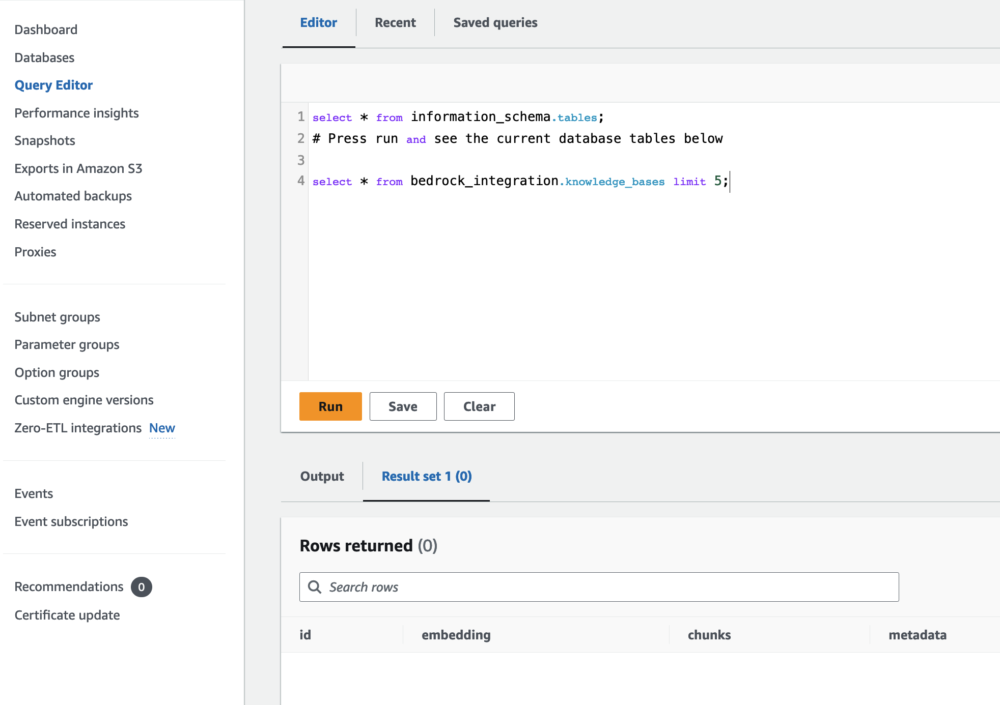

# Part 1: Building an Amazon Aurora PostgreSQL vector database as a Knowledge Base for Amazon Bedrock.

Welcome to the first installment of our four-part series on creating a WhatsApp-powered RAG Travel Support Agent. In this part, we'll dive into the foundational step of our architecture: setting up an Amazon Aurora PostgreSQL vector database. This database will serve as the backbone of our knowledge base for Amazon Bedrock, enabling fast and efficient retrieval of information for our AI-powered travel assistant.

## The Importance of Vector Databases

Vector databases are crucial for implementing Retrieval Augmented Generation (RAG) systems, as they allow for semantic search capabilities that go beyond traditional keyword matching. By using Amazon Aurora PostgreSQL with vector support, we're leveraging a powerful, scalable, and fully managed database service that's optimized for AI and machine learning workloads.

## Overview of the Setup Process

In this part, we'll use [AWS Cloud Development Kit (CDK)](https://aws.amazon.com/cdk) for Python to:

1. Set up an Amazon Aurora PostgreSQL Serverless v2 database cluster
2. Create a database secret
3. Initialize a custom resource to set up a PostgreSQL table
4. Grant necessary permissions to the custom resource
5. Store key information in the [AWS Systems Manager (SSM) Parameter Store](https://docs.aws.amazon.com/systems-manager/latest/userguide/systems-manager-parameter-store.html).

Once completed, our Aurora PostgreSQL database will be ready to serve as a Knowledge Base for Amazon Bedrock.

## Detailed Preparation Steps

Our setup process, automated through an AWS Lambda function via a custom resource in CDK, involves the following key steps:


The preparation consists of the following steps:

1- Install the pgvector extension (version 0.5.0 or higher):

```sql
CREATE EXTENSION IF NOT EXISTS vector;
SELECT extversion FROM pg_extension WHERE extname='vector';
```
This enables vector storage and HNSW indexing, crucial for efficient similarity searches.

2- Create a dedicated schema and user role:

```sql
CREATE SCHEMA bedrock_integration;
CREATE ROLE bedrock_user WITH PASSWORD password LOGIN;
```
This segregates our Bedrock-related data and provides controlled access.

3. Grant permissions to the bedrock_user:
```sql
GRANT ALL ON SCHEMA bedrock_integration to bedrock_user;
```
This allows the user to manage the schema, including creating tables and indexes.


4. Create the knowledge base table:
```sql
CREATE TABLE IF NOT EXISTS bedrock_integration.bedrock_kb (
    id uuid PRIMARY KEY,
    embedding vector(1024), 
    chunks text,
    metadata json
);
```
This table structure accommodates vector embeddings, text chunks, and associated metadata. You should use vector length [according to the embedding model's](https://docs.aws.amazon.com/bedrock/latest/userguide/knowledge-base-supported.html) output dimension. Here we are using 1024 which is compatible with Amazon Titan Embeddings V2 and Cohere Embeddings. 

If you want to leverage [document metadata for filtering ](https://docs.aws.amazon.com/bedrock/latest/userguide/knowledge-base-ds.html#kb-ds-metadata) you need to add those fields as columns. For example, if you need to filter by topic or language, add those columns in advance: 

```sql
CREATE TABLE IF NOT EXISTS bedrock_integration.bedrock_kb (
    id uuid PRIMARY KEY, 
    embedding vector(1024), 
    chunks text, metadata json, 
    topic text, language varchar(10)
);
```


5. Create an index for efficient similarity searches:
```sql
CREATE INDEX on bedrock_integration.bedrock_kb USING hnsw (embedding vector_cosine_ops);
```
This HNSW (Hierarchical Navigable Small World) index optimizes cosine similarity searches.

## Building the Infrastructure

✅ To set up this infrastructure:

1. Navigate to the project directory:
```
cd 01-create-aurora-pgvector
```

2. Create and activate a virtual environment:
```
python3 -m venv .venv
source .venv/bin/activate
```
For Windows:
```
.venv\Scripts\activate.bat
```

>[CDK Guide](https://docs.aws.amazon.com/cdk/v2/guide/hello_world.html) 

3. Install the required dependencies:
```
pip install -r requirements.txt
```

4. Deploy the CDK stack (this may take some time):
```
cdk deploy
```

You can monitor the deployment progress in the [AWS CloudFormation console](https://console.aws.amazon.com/cloudformation).


### About the VPC

This stack creates a new VPC, be aware of reaching [service limits](https://docs.aws.amazon.com/vpc/latest/userguide/amazon-vpc-limits.html) and adjust in advance. Also, since the app uses [RDS Data API](https://docs.aws.amazon.com/rdsdataservice/latest/APIReference/API_ExecuteStatement.html), it doesn't need internet access (nat_gateways = 0)


```python 
# Crear una VPC
self.vpc = ec2.Vpc(self, "VPC", max_azs=2, nat_gateways=0)
```
You can use an existing VPC changing the CDK code.

### Take a look at the fresh Aurora Serverless Cluster in the RDS Console

Go to the [RDS Query Editor](https://us-east-1.console.aws.amazon.com/rds/home?region=us-east-1#query-editor:) and access your cluster (using the Database Secret ARN: bedrockSecretXXX)

Execute `select * from bedrock_integration.knowledge_bases limit 5;` to see the empty table that you just created.



### Security best practice

Database credentials are stored as Secrets in [AWS Secrets Manager](https://aws.amazon.com/secrets-manager) which is a service to centrally and securely store and access credentials. Never store credentials in your code or environment variables.


## 💰 Associated Costs

Be aware of the costs associated with the following AWS services:

- [Amazon Aurora Pricing](https://aws.amazon.com/rds/aurora/pricing/)
- [Amazon Lambda Pricing](https://aws.amazon.com/lambda/pricing/)
- [AWS Systems Manager pricing](https://aws.amazon.com/systems-manager/pricing/)

> 👾 Note: You can custom the Aurora PostgreSQL Serverless v2 database cluster [settings](https://github.com/build-on-aws/rag-postgresql-agent-bedrock/blob/main/01-create-aurora-pgvector/rds/rds.py). For more information, refer to the [Requirements and limitations for Aurora Serverless v2](https://docs.aws.amazon.com/AmazonRDS/latest/AuroraUserGuide/aurora-serverless-v2.requirements.html).

## Next Steps

With your Amazon Aurora PostgreSQL vector database now set up, you're ready to move on to the next part of our series, where we'll create a Knowledge Base for Amazon Bedrock using this database. This will bring us one step closer to our goal of building a sophisticated, AI-powered travel support agent.