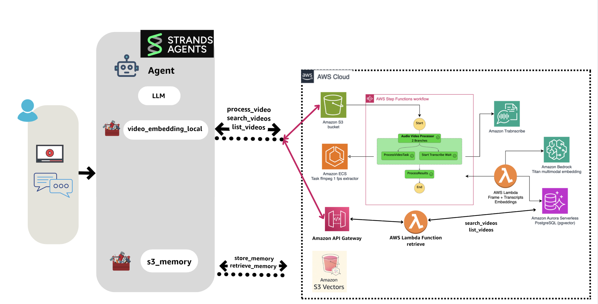

# 📓 Jupyter Notebooks - Interactive Learning Path

<div align="center">


### 🎯 **Master Multimodal AI Through Hands-On Tutorials**

[](.)
[](.)
[](.)

</div>

Learn multimodal AI through practical tutorials that demonstrate text, image, and video processing with Amazon Bedrock and AWS services.

---

## 📚 Complete Learning Sequence

| 📓 Notebook | 🎯 Focus & Key Learning | ⏱️ Time | 📊 Level | 🖼️ Diagram |
|-------------|------------------------|----------|----------|------------|
| **01 - [Semantic Search with LangChain, Amazon Titan Embeddings, and FAISS](01_build_pdf_vector_db.ipynb)** | Text embeddings and PDF processing - Document chunking, embeddings generation, FAISS vector store operations | 30 min |  |  |
| **02 - [Building a Multimodal Image Search App with Titan Embeddings](02_build_images_vector_db.ipynb)** | Visual search capabilities - Image embeddings, multimodal search, natural language image queries | 45 min |  |  |
| **03 - [Supercharging Vector Similarity Search with Amazon Aurora and pgvector](03_build_pgvector_db.ipynb)** | Production database setup - PostgreSQL vector operations, pgvector extension, scalable similarity search | 60 min |  | |
| **04 - [Video Understanding](04_video_understanding.ipynb)** | Video content analysis - Nova models for video processing, content extraction, video understanding workflows | 45 min |  |  |
| **05 - [Video and Audio Content Analysis with Amazon Bedrock](05_create_audio_video_embeddings.ipynb)** | Audio processing workflows - Transcription, audio embeddings, multimedia content analysis | 40 min |  |  |
| **06 - [Building Agentic Video RAG with Strands Agents - Local](06_video_embeddings_with_strands_enhanced.ipynb)** | AI agents for video analysis - Local agent implementation, memory-enhanced agents, persistent context storage | 90 min |  |  |
| **07 - [Building Agentic Video RAG with Strands Agents - Cloud](07_video_embeddings_container_with_strands_agents.ipynb)** | Production agent deployment - Cloud-based agent architecture, ECS deployment, scalable agent workflows | 120 min |  |  |

---

## 🔧 AWS Services You'll Use

| 🔧 Service | 🎯 Purpose | ⚡ Key Capabilities |
|-------------|------------|---------------------|
| **[Amazon Bedrock](https://aws.amazon.com/bedrock/?trk=4f1e9f0e-7b21-4369-8925-61f67341d27c&sc_channel=el)** | AI model access | Titan Embeddings, Nova models for multimodal processing |
| **[Amazon Aurora PostgreSQL](https://aws.amazon.com/rds/aurora/?trk=4f1e9f0e-7b21-4369-8925-61f67341d27c&sc_channel=el)** | Vector database | pgvector extension for similarity search operations |
| **[Amazon S3](https://aws.amazon.com/s3/?trk=4f1e9f0e-7b21-4369-8925-61f67341d27c&sc_channel=el)** | Object storage | Document, image, and video content storage |
| **[Amazon Transcribe](https://aws.amazon.com/transcribe/?trk=4f1e9f0e-7b21-4369-8925-61f67341d27c&sc_channel=el)** | Speech-to-text | Audio content extraction from video files |

---

## 🛠️ Prerequisites & Setup

**📋 Before You Begin:**
- ✅ AWS Account with Amazon Bedrock access enabled
- ✅ Python 3.8+ installed locally
- ✅ AWS CLI configured with appropriate permissions
- ✅ Jupyter Notebook or JupyterLab installed

**📦 Required Python Packages:**
```bash
# All requirements are in requirements.txt
# Install after creating virtual environment (see Quick Start Guide)
```

**🔑 AWS Credentials Setup:**
Follow the [AWS credentials configuration guide](https://docs.aws.amazon.com/braket/latest/developerguide/braket-using-boto3.html?trk=4f1e9f0e-7b21-4369-8925-61f67341d27c&sc_channel=el) to configure your environment.

---

## 🚀 Quick Start Guide

### 1️⃣ **Clone & Setup Environment** (3 minutes)
```bash
git clone https://github.com/build-on-aws/langchain-embeddings.git
cd langchain-embeddings/notebooks

# Create virtual environment
python -m venv venv

# Activate environment (macOS/Linux)
source venv/bin/activate
# Or on Windows
# venv\Scripts\activate

# Install requirements
pip install -r requirements.txt
```

### 2️⃣ **Start Learning** (30 seconds)
```bash
jupyter notebook 01_build_pdf_vector_db.ipynb
```

### 3️⃣ **Follow the Path** 
Complete notebooks 01-07 in sequence for the best learning experience.

---

## 💰 Estimated Costs

| 💰 Notebook Range | 🔧 AWS Services Used | 
|-------------------|---------------------|
| **01-02** | Bedrock, S3 | 
| **03** | Aurora PostgreSQL | 
| **04-05** | Bedrock, Transcribe, S3 |
| **06-07** | Full stack | 

> 💡 **Pro Tip:** Use AWS Free Tier when possible and monitor costs through [AWS Cost Explorer](https://aws.amazon.com/aws-cost-management/aws-cost-explorer/?trk=4f1e9f0e-7b21-4369-8925-61f67341d27c&sc_channel=el).

---

## 💡 Learning Tips for Success

| 🎯 Tip | 📝 Description |
|---------|----------------|
| **📚 Start Sequential** | Follow the numbered order for best learning experience |
| **🔬 Experiment** | Modify code examples to understand concepts better |
| **💰 Monitor Costs** | Check AWS usage, especially for Bedrock API calls |
| **💾 Save Work** | Export important results before closing notebooks |

---

## 🔗 Additional Learning Resources

- 📖 [Amazon Bedrock Documentation](https://docs.aws.amazon.com/bedrock/?trk=4f1e9f0e-7b21-4369-8925-61f67341d27c&sc_channel=el)
- 🦜 [LangChain Python Documentation](https://python.langchain.com/)
- 🔍 [FAISS Documentation](https://faiss.ai/)
- 🗄️ [pgvector Documentation](https://github.com/pgvector/pgvector)

---

<div align="center">

## 🏠 Ready to Deploy? 

**Completed the notebooks? Take your learning to production!**

[](../README.md)
[](../create-aurora-pgvector/)
[](../serveless-embeddings/)
[](../container-video-embeddings/)

### ⭐ **Found this helpful? Star the repository!** ⭐

[](https://star-history.com/#build-on-aws/langchain-embeddings&Date)

**🎯 [Explore More AWS Learning Resources](https://github.com/build-on-aws) • 🚀 [Join the AWS Community](https://builder.aws.com/)**

</div>

---

## 📄 License

This library is licensed under the MIT-0 License. See the [LICENSE](../LICENSE) file for details.
