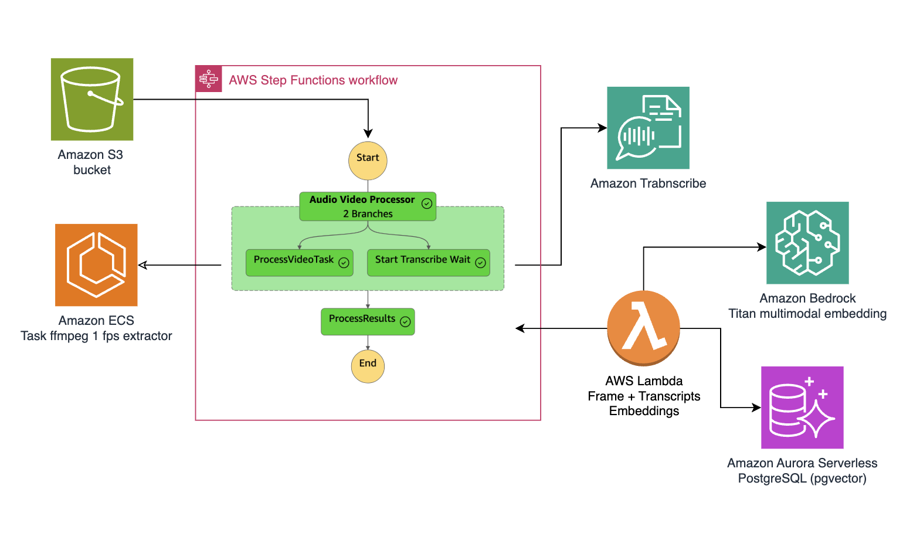

# Jupyter Notebooks - Multimodal Search Engine

This directory contains comprehensive Jupyter notebooks that guide you through building a multimodal search engine capable of processing text, images, and video content using Amazon Bedrock, LangChain, and various AWS services.

## Prerequisites

- [Configure AWS credentials](https://docs.aws.amazon.com/braket/latest/developerguide/braket-using-boto3.html)

## 🚀 Deployment Guide

### 1. Clone the repository:

```bash
git clone https://github.com/build-on-aws/langchain-embeddings
cd notebooks
```
### 2. Set up the environment:
Create a virtual environment:

```bash
python3 -m venv .venv
```

Activate the virtual environment:
```bash
# For Linux/macOS
source .venv/bin/activate

# For Windows
.venv\Scripts\activate.bat
```

Install dependencies:
```bash
pip install -r requirements.txt
```

## Notebooks Overview

| Notebook | Description | Architecture |
|----------|-------------|--------------|
| **[01_build_pdf_vector_db.ipynb](01_build_pdf_vector_db.ipynb)** | **Semantic Search with LangChain, Amazon Titan Embeddings, and FAISS**<br/>Load documents from PDFs, extract and split text into semantically meaningful chunks using LangChain, generate text embeddings using Amazon Titan Embeddings G1, and store embeddings in a FAISS vector database for retrieval. |  |
| **[02_build_images_vector_db.ipynb](02_build_images_vector_db.ipynb)** | **Building a Multimodal Image Search App with Titan Embeddings**<br/>Combine Titan Multimodal Embeddings, LangChain and FAISS to build an image search application. Generate embeddings for images and text in a common vector space, enabling natural language querying of images with fast, scalable FAISS indexing. |  |
| **[03_build_pgvector_db.ipynb](03_build_pgvector_db.ipynb)** | **Supercharging Vector Similarity Search with Amazon Aurora and pgvector**<br/>Store vector embeddings in Amazon Aurora PostgreSQL with pgvector extension. Ideal for applications requiring efficient similarity searches on high-dimensional data for NLP, image recognition, and recommendation systems. |  |
| **[04_video_understanding.ipynb](04_video_understanding.ipynb)** | **Video Understanding with Amazon Nova Models**<br/>Process videos using Amazon Nova models for video understanding. Handles videos under 25MB via base64 conversion, and larger videos through S3 upload. Demonstrates multimodal AI capabilities for video content analysis. |  |
| **[05_create_audio_video_embeddings.ipynb](05_create_audio_video_embeddings.ipynb)** | **Video and Audio Content Analysis with Amazon Bedrock and Aurora PostgreSQL**<br/>Process video and audio content using Amazon Bedrock with Titan Multimodal Embeddings G1 model. Generate embeddings and store them in Amazon Aurora PostgreSQL with pgvector for similarity search capabilities. |  |
| **[06_video_embeddings_with_strands_fixed.ipynb](06_video_embeddings_with_strands_fixed.ipynb)** | **Video Content Analysis with Strands Agents and Amazon Bedrock**<br/>Build a comprehensive video content analysis system using Amazon Bedrock, Amazon Transcribe, and Aurora PostgreSQL, integrated with Strands Agents. Create two types of AI agents: Video Analysis Agent for global content processing and Memory-Enhanced Agent for personalized, context-aware analysis. |  |
| **[07_video_embeddings_container_with_strands.ipynb](07_video_embeddings_container_with_strands.ipynb)** | **Video Embeddings with Strands and AWS Infrastructure**<br/>Use deployed AWS infrastructure from container-video-embeddings CDK stacks with Strands agents for scalable video processing and semantic search. Leverages production-ready AWS services including ECS, Step Functions, and API Gateway for enterprise-grade video analysis. |  |

## Learning Path

### Beginner Level
1. **Start with [01_build_pdf_vector_db.ipynb](01_build_pdf_vector_db.ipynb)** - Learn the fundamentals of text processing and vector embeddings
2. **Continue with [02_build_images_vector_db.ipynb](02_build_images_vector_db.ipynb)** - Expand to multimodal search with images

### Intermediate Level
3. **Explore [03_build_pgvector_db.ipynb](03_build_pgvector_db.ipynb)** - Scale up with production-ready vector databases
4. **Try [04_video_understanding.ipynb](04_video_understanding.ipynb)** - Understand video content analysis basics

### Advanced Level
5. **Work through [05_create_audio_video_embeddings.ipynb](05_create_audio_video_embeddings.ipynb)** - Build comprehensive video processing pipelines
6. **Implement [06_video_embeddings_with_strands_fixed.ipynb](06_video_embeddings_with_strands_fixed.ipynb)** - Create intelligent agents for video analysis
7. **Deploy [07_video_embeddings_container_with_strands.ipynb](07_video_embeddings_container_with_strands.ipynb)** - Use production infrastructure for scalable solutions

## Key Technologies

- **Amazon Bedrock**: Foundation models and embeddings
- **Amazon Titan Embeddings**: Text and multimodal embeddings
- **Amazon Nova Models**: Video understanding capabilities
- **LangChain**: Framework for LLM applications
- **FAISS**: Fast similarity search and clustering
- **Amazon Aurora PostgreSQL**: Scalable vector database with pgvector
- **Strands Agents**: AI agent development platform
- **AWS CDK**: Infrastructure as code

## Cost Considerations

Review pricing for the following services:
- [Amazon Bedrock Pricing](https://aws.amazon.com/bedrock/pricing/)
- [Amazon S3 Pricing](https://aws.amazon.com/s3/pricing/)
- [Amazon Aurora Pricing](https://aws.amazon.com/rds/aurora/pricing/)
- [Amazon Transcribe Pricing](https://aws.amazon.com/transcribe/pricing/)

## 🚀 Some links for you to continue learning and building:

- [Getting started with Amazon Bedrock, RAG, and Vector database in Python](https://github.com/build-on-aws/llm-rag-vectordb-python)
- [Building with Amazon Bedrock and LangChain](https://catalog.workshops.aws/building-with-amazon-bedrock/en-US)
- [How To Choose Your LLM](https://community.aws/posts/how-to-choose-your-llm)
- [Working With Your Live Data Using LangChain](https://community.aws/posts/working-with-your-live-data-using-langchain)


----

## 🇻🇪🇨🇱 ¡Gracias!

---

## Security

See [CONTRIBUTING](CONTRIBUTING.md#security-issue-notifications) for more information.

## License

This library is licensed under the MIT-0 License. See the LICENSE file.

