# Serverless Vector Database System for Multi-Modal Document/Image Processing

> This documentation was created with the help of [Generating documentation with Amazon Q Developer](https://docs.aws.amazon.com/amazonq/latest/qdeveloper-ug/doc-generation.html)

Build a Serverless Embedding App with the AWS Cloud Development Kit (CDK) to create four AWS Lambda Functions.

This serverless solution creates, manages, and queries vector databases for PDF documents and images with Amazon Bedrock embeddings. You can use FAISS vector stores or Aurora PostgreSQL with pgvector for efficient similarity searches across multiple data types.

This project offers a complete serverless infrastructure for document processing and retrieval, using AWS Lambda functions to manage workflow tasks. With Amazon Bedrock for embedding generation, you can perform both text-based and image-based queries, making it ideal for multi-modal search applications.


💰 **Cost to complete**: 
- [Amazon Bedrock Pricing](https://aws.amazon.com/bedrock/pricing/)
- [AWS Lambda Pricing](https://aws.amazon.com/lambda/pricing/)
- [Amazon Aurora Pricing](https://aws.amazon.com/rds/aurora/pricing/)
- [Amazon S3 Pricing](https://aws.amazon.com/s3/pricing/)

>Learn [how test Lambda Functions in the console](https://docs.aws.amazon.com/lambda/latest/dg/testing-functions.html) with test events. 

### AWS Lambda Funtions to Generating Embeddings for Text and Image Files:

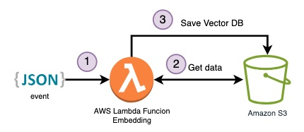

To handle the embedding process, there is a dedicated Lambda Function for each file type:

- ## [To generate embeddings for the text content of PDF files with FAISS](serveless-embeddings/lambdas/code/build_pdf_vector_db/lambda_function.py). 

Event to trigger: 

```json
{
    "location": "REPLACE-YOU-KEY",
    "vectorStoreLocation": "REPALCE-NAME.vdb",
    "bucketName": "REPLACE-YOU-BUCKET",
    "vectorStoreType": "faiss",
    "splitStrategy": "semantic",
    "fileType": "application/pdf", 
    "embeddingModel": "amazon.titan-embed-text-v1"
  }
```
| Event  |Executing function: succeeded |
|---|---|
|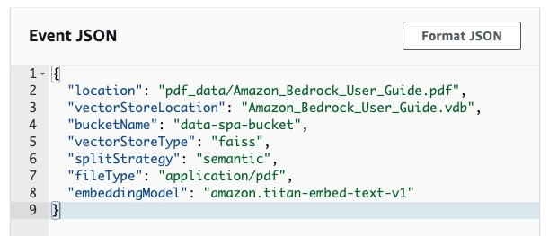||
|||

- ## [To generate embeddings for images with FAISS](serveless-embeddings/lambdas/code/build_image_vector_db/lambda_function.py).

Event to trigger: 

```json
{
    "location": "REPLACE-YOU-KEY-FOLDER",
    "vectorStoreLocation": "REPLACE-NAME.vdb",
    "bucketName": "REPLACE-YOU-BUCKET",
    "vectorStoreType": "faiss",
    "splitStrategy": "semantic",
    "embeddingModel": "amazon.titan-embed-image-v1"
  }
```

| Event  |Executing function: succeeded |
|---|---|
|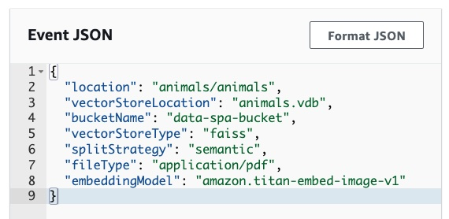||
|||

- ## [To generate embeddings for image/pdf with pgvector and Amazon Aurora](serveless-embeddings/lambdas/code/build_aurora_postgre_vector_db/lambda_function.py).


> 💡 Before testing this Lambda Function keep in mind that it must be in the same VPC and be able to access the Amazon Aurora PostreSQL DB, for that check [Automatically connecting a Lambda function and an Aurora DB cluster](https://docs.aws.amazon.com/AmazonRDS/latest/AuroraUserGuide/lambda-rds-connect.html), [Using Amazon RDS Proxy for Aurora](https://docs.aws.amazon.com/AmazonRDS/latest/AuroraUserGuide/rds-proxy.html) and [Use interface VPC endpoints (AWS PrivateLink)](https://docs.aws.amazon.com/bedrock/latest/userguide/usingVPC.html#vpc-interface-endpoints) for Amazon Bedrock VPC endpoint. 

Event to trigger: 

```json
{
  "location": "YOU-KEY",
  "bucketName": "YOU-BUCKET-NAME",
  "fileType": "pdf or image",
  "embeddingModel": "amazon.titan-embed-text-v1", 
  "PGVECTOR_USER":"YOU-RDS-USER",
  "PGVECTOR_PASSWORD":"YOU-RDS-PASSWORD",
  "PGVECTOR_HOST":"YOU-RDS-ENDPOINT-PROXY",
  "PGVECTOR_DATABASE":"YOU-RDS-DATABASE",
  "PGVECTOR_PORT":"5432",
  "collectioName": "YOU-collectioName",
  "bedrock_endpoint": "https://vpce-...-.....bedrock-runtime.YOU-REGION.vpce.amazonaws.com"
}
```

| Event PDF  |Executing function: succeeded |
|---|---|
|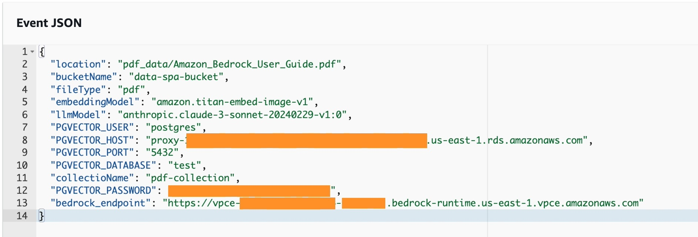|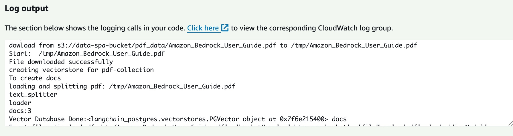|
|||

| Event Image  |Executing function: succeeded |
|---|---|
|||
|||


### AWS Lambda Funtions to Query for Text and Image Files in a Vector DB:

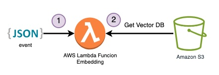

To handle the embedding process, there is a dedicated Lambda Function for each file type:

- [To retrieval text content from a vector DB](serveless-embeddings/lambdas/code/pdf_retriever_lambda/lambda_function.py)

Event to trigger: 

```json
{
  "vectorStoreLocation": "REPLACE-NAME.vdb",
  "bucketName": "REPLACE-YOU-BUCKET",
  "vectorStoreType": "faiss",
  "query": "YOU-QUERY",
  "numDocs": 5,
  "embeddingModel": "amazon.titan-embed-text-v1"
}

```
| Event  |Executing function: succeeded |
|---|---|
|||
|||

- [To retrieval image location from a vector DB](serveless-embeddings/lambdas/code/pdf_retriever_lambda/lambda_function.py)

You can search by text or by image

- Text event to trigger
```json
{
  "vectorStoreLocation": "REPLACE-NAME.vdb",
  "bucketName": "REPLACE-YOU-BUCKET",
  "vectorStoreType": "faiss",
  "InputType": "text",
  "query":"TEXT-QUERY",
  "embeddingModel": "amazon.titan-embed-text-v1"
}
```

| Event  |Executing function: succeeded |
|---|---|
|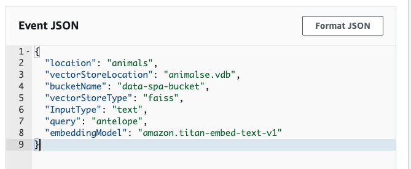|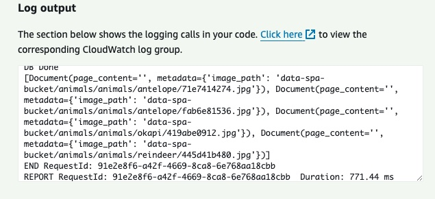|
|||

- Image event to trigger
```json
{
  "vectorStoreLocation": "REPLACE-NAME.vdb",
  "bucketName": "REPLACE-YOU-BUCKET",
  "vectorStoreType": "faiss",
  "InputType": "image",
  "query":"IMAGE-BUCKET-LOCATION-QUERY",
  "embeddingModel": "amazon.titan-embed-text-v1"
}
```
| Event  |Executing function: succeeded |
|---|---|
||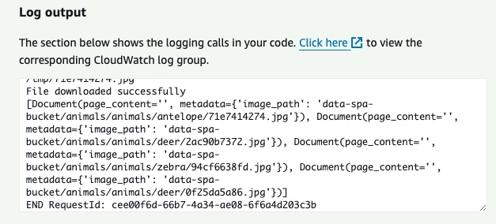|
|||

> 💡 The next step is to take the `image_path` value and download the file from Amazon S3 bucket with a [download_file boto3](https://boto3.amazonaws.com/v1/documentation/api/latest/guide/s3-example-download-file.html) method. 

- [To generate embeddings for image/pdf with pgvector and Amazon Aurora](serveless-embeddings/lambdas/code/build_aurora_postgre_vector_db/lambda_function.py).

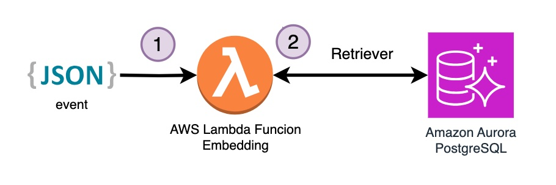

```json
{
  "location": "YOU-KEY",
  "bucketName": "YOU-BUCKET-NAME",
  "fileType": "pdf or image",
  "embeddingModel": "amazon.titan-embed-text-v1", 
  "PGVECTOR_USER":"YOU-RDS-USER",
  "PGVECTOR_PASSWORD":"YOU-RDS-PASSWORD",
  "PGVECTOR_HOST":"YOU-RDS-ENDPOINT-PROXY",
  "PGVECTOR_DATABASE":"YOU-RDS-DATABASE",
  "PGVECTOR_PORT":"5432",
  "collectioName": "YOU-collectioName",
  "bedrock_endpoint": "https://vpce-...-.....bedrock-runtime.YOU-REGION.vpce.amazonaws.com",
  "QUERY": "YOU-TEXT-QUESTION"
  }
```

> 💡 Use `location` and `bucketName`to deliver image location to make a query.

| Event PDF  |Executing function: succeeded |
|---|---|
|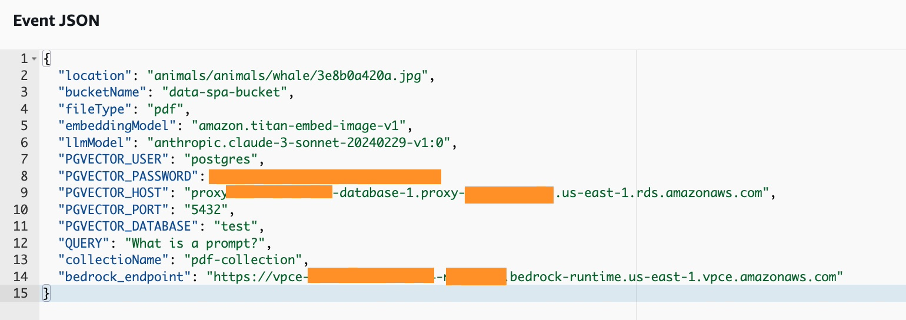||
|||

| Event Image Query Text  |Executing function: succeeded |
|---|---|
||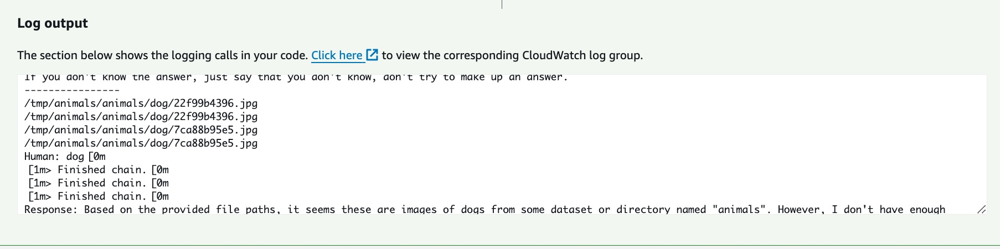|
|||

| Event Image Query Image |Executing function: succeeded |
|---|---|
|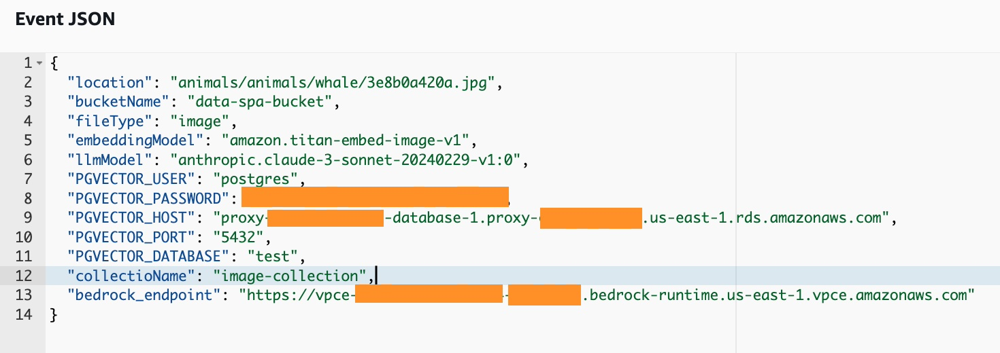||
|||

### 🚀 Let's build!

The Amazon Lambdas that you build in this deployment are created with a [container images](https://docs.aws.amazon.com/lambda/latest/dg/images-create.html), you must have [Docker Desktop](https://www.docker.com/products/docker-desktop/) installed and active in your computer. 

**Step 1:  APP Set Up**

✅ Clone the repo

```
git clone https://github.com/build-on-aws/langchain-embeddings
```

✅ Go to: 

```
cd serveless-embeddings
```

- Configure the [AWS Command Line Interface](https://docs.aws.amazon.com/cli/latest/userguide/cli-chap-configure.html)

- Deploy architecture with CDK [Follow steps:](/private-assistant/README.md)

**Step 2: Deploy architecture with CDK.**

✅ Create The Virtual Environment: by following the steps in the [README](/private-assistant/README.md)

```
python3 -m venv .venv
```

```
source .venv/bin/activate
```
for windows: 

```
.venv\Scripts\activate.bat
```

✅ Install The Requirements:

```
pip install -r requirements.txt
```

✅ Synthesize The Cloudformation Template With The Following Command:

```
cdk synth
```

✅🚀 The Deployment:

```
cdk deploy
```

**🧹 Clean the house!:**

If you finish testing and want to clean the application, you just have to follow these two steps:

1. Delete the files from the Amazon S3 bucket created in the deployment. 
2. Run this command in your terminal:

```
cdk destroy
```

## Conclusion:

In this post, you built a powerful multimodal search engine capable of handling both text and images using Amazon Titan Embeddings, Amazon Bedrock, Amazon Aurora PostgreSQL, and LangChain. You generated embeddings, stored the data in both FAISS vector databases and Amazon Aurora Postgre, and developed applications for semantic text and image search.

Additionally, you deployed a serverless application using AWS CDK with Lambda Functions to integrate embedding and retrieval capabilities through events, providing a scalable solution.

Now you have the tools to create your own multimodal search engines, unlocking new possibilities for your applications. Explore the code, experiment, and share your experiences in the comments.

## 🚀 Some links for you to continue learning and building:

- [Getting started with Amazon Bedrock, RAG, and Vector database in Python](https://github.com/build-on-aws/llm-rag-vectordb-python)
- [Building with Amazon Bedrock and LangChain](https://catalog.workshops.aws/building-with-amazon-bedrock/en-US)
- [How To Choose Your LLM](https://community.aws/posts/how-to-choose-your-llm)
- [Working With Your Live Data Using LangChain](https://community.aws/posts/working-with-your-live-data-using-langchain)
